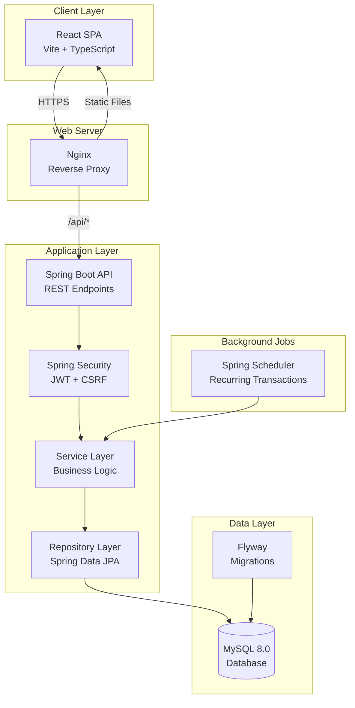
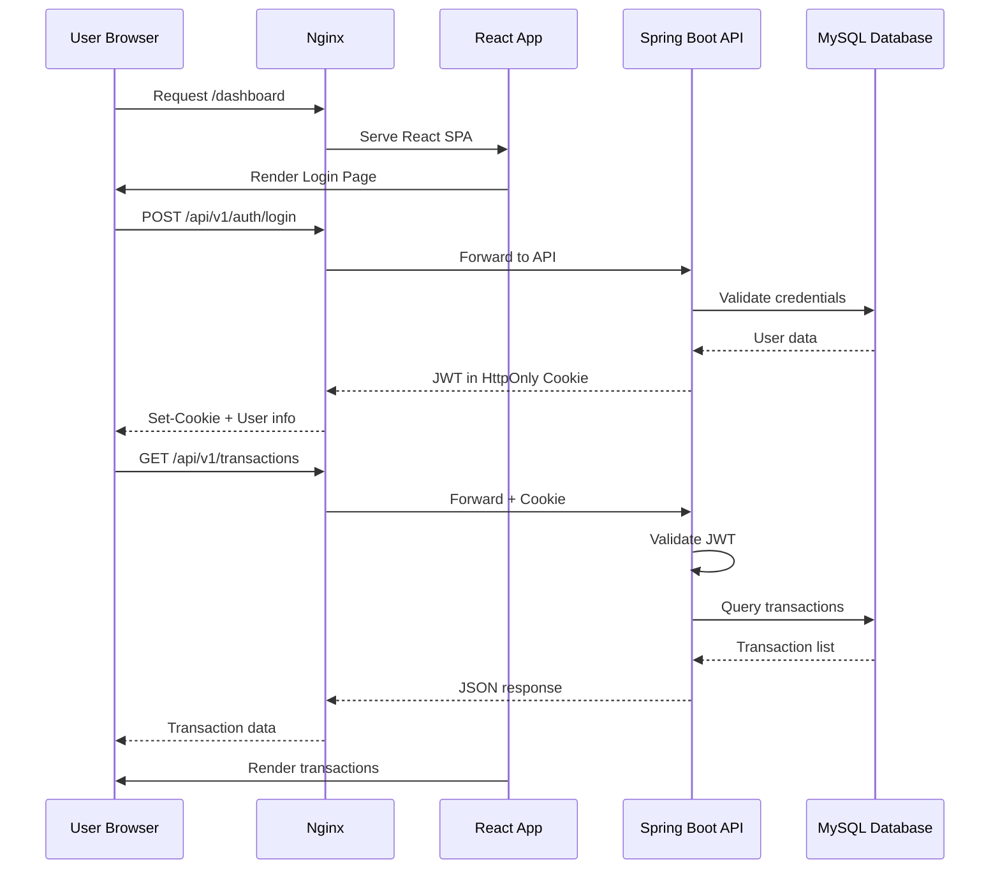
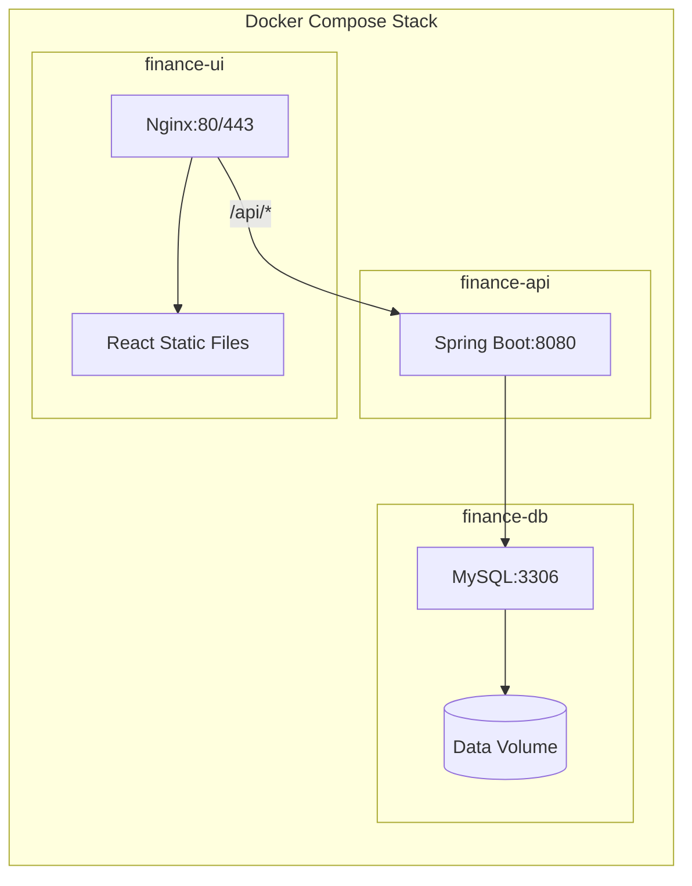
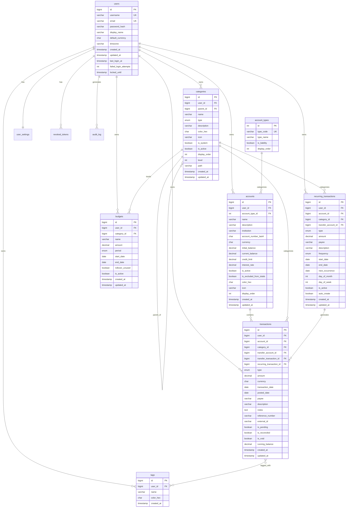

# Personal Finance Tracker

> **Technical Design Document (TDD) & Requirements Specification**
>
> Version: 1.0.0 | Last Updated: November 25, 2025 | Status: **FROZEN**

A comprehensive personal finance tracking web application for managing expenses, incomes, accounts, categories, budgets, and viewing financial insights through interactive reports and dashboards.

---

## Table of Contents

1. [Project Overview](#1-project-overview)
2. [Technology Stack](#2-technology-stack)
3. [System Architecture](#3-system-architecture)
4. [Project Structure](#4-project-structure)
5. [Database Schema](#5-database-schema)
6. [API Specification](#6-api-specification)
7. [Feature Specifications](#7-feature-specifications)
8. [UI/UX Specifications](#8-uiux-specifications)
9. [Security Specifications](#9-security-specifications)
10. [Development Phases & Timeline](#10-development-phases--timeline)
11. [Docker Configuration](#11-docker-configuration)
12. [Testing Strategy](#12-testing-strategy)
13. [Risks & Mitigations](#13-risks--mitigations)
14. [Glossary](#14-glossary)

---

## 1. Project Overview

### 1.1 Purpose

Build a personal finance management application that enables a single user to:

- Track income and expenses across multiple accounts
- Categorize transactions with hierarchical categories
- Set and monitor budgets
- Schedule recurring transactions
- View financial insights through interactive charts and reports
- Import/export financial data

### 1.2 Target User

- **Primary User**: Single individual managing personal finances
- **Use Case**: Personal budgeting, expense tracking, financial planning
- **Access**: Web browser (desktop and mobile responsive)

### 1.3 Key Features Summary

| Feature | Description |
|---------|-------------|
| **Multi-Account Management** | Track checking, savings, cash, credit cards, investments, loans |
| **Transaction Tracking** | Record income, expenses, and transfers with full audit trail |
| **Hierarchical Categories** | Organize spending with parent/child category structure |
| **Budget Management** | Set spending limits by category with alerts |
| **Recurring Transactions** | Automate scheduled income/expenses |
| **Dashboard & Reports** | Visual analytics with charts and trends |
| **Import/Export** | CSV import/export for data portability |
| **Secure Authentication** | JWT-based auth with HttpOnly cookies |

### 1.4 Out of Scope (v1.0)

- Multi-user/family sharing
- Bank account synchronization (Plaid/Yodlee)
- Mobile native apps (iOS/Android)
- Investment portfolio tracking
- Bill payment integration
- Receipt OCR scanning

---

## 2. Technology Stack

### 2.1 Backend

| Technology | Version | Purpose |
|------------|---------|---------|
| **Java** | 21 LTS | Programming language |
| **Spring Boot** | 3.2.x | Application framework |
| **Spring Security** | 6.x | Authentication & authorization |
| **Spring Data JPA** | 3.2.x | Database access layer |
| **Hibernate** | 6.x | ORM implementation |
| **MySQL** | 8.0+ | Relational database |
| **Flyway** | 10.x | Database migrations |
| **Lombok** | 1.18.x | Boilerplate reduction |
| **MapStruct** | 1.5.x | DTO mapping |
| **Gradle** | 8.x | Build tool |

### 2.2 Frontend

| Technology | Version | Purpose |
|------------|---------|---------|
| **React** | 18.x | UI library |
| **TypeScript** | 5.x | Type-safe JavaScript |
| **Vite** | 5.x | Build tool & dev server |
| **TailwindCSS** | 3.x | Utility-first CSS |
| **React Router** | 6.x | Client-side routing |
| **TanStack Query** | 5.x | Server state management |
| **React Hook Form** | 7.x | Form handling |
| **Zod** | 3.x | Schema validation |
| **Recharts** | 2.x | Chart library |
| **Lucide React** | Latest | Icon library |

### 2.3 DevOps & Infrastructure

| Technology | Version | Purpose |
|------------|---------|---------|
| **Docker** | 24.x | Containerization |
| **Docker Compose** | 2.x | Multi-container orchestration |
| **Nginx** | 1.25.x | Reverse proxy & static serving |

### 2.4 Testing

| Technology | Purpose |
|------------|---------|
| **JUnit 5** | Backend unit testing |
| **Mockito** | Mocking framework |
| **Testcontainers** | Integration testing with real DB |
| **Vitest** | Frontend unit testing |
| **React Testing Library** | Component testing |
| **Playwright** | E2E testing |

### 2.5 Documentation & API

| Technology | Purpose |
|------------|---------|
| **SpringDoc OpenAPI** | API documentation |
| **Swagger UI** | Interactive API explorer |

---

## 3. System Architecture

### 3.1 High-Level Architecture



### 3.2 Component Interaction Flow



### 3.3 Deployment Architecture



---

## 4. Project Structure

### 4.1 Monorepo Layout

```text
finance-tracker/
├── README.md                    # This document
├── docker-compose.yml           # Production compose
├── docker-compose.dev.yml       # Development compose
├── .env.example                 # Environment template
├── .gitignore
│
├── backend/                     # Spring Boot Application
│   ├── Dockerfile
│   ├── build.gradle
│   ├── settings.gradle
│   ├── gradle/
│   │   └── wrapper/
│   ├── gradlew
│   ├── gradlew.bat
│   └── src/
│       ├── main/
│       │   ├── java/com/financetracker/
│       │   │   ├── FinanceTrackerApplication.java
│       │   │   ├── config/
│       │   │   │   ├── SecurityConfig.java
│       │   │   │   ├── JwtConfig.java
│       │   │   │   ├── CorsConfig.java
│       │   │   │   ├── OpenApiConfig.java
│       │   │   │   └── SchedulerConfig.java
│       │   │   ├── controller/
│       │   │   │   ├── AuthController.java
│       │   │   │   ├── AccountController.java
│       │   │   │   ├── CategoryController.java
│       │   │   │   ├── TransactionController.java
│       │   │   │   ├── BudgetController.java
│       │   │   │   ├── RecurringTransactionController.java
│       │   │   │   ├── ReportController.java
│       │   │   │   └── SettingsController.java
│       │   │   ├── dto/
│       │   │   │   ├── request/
│       │   │   │   └── response/
│       │   │   ├── entity/
│       │   │   │   ├── User.java
│       │   │   │   ├── Account.java
│       │   │   │   ├── AccountType.java
│       │   │   │   ├── Category.java
│       │   │   │   ├── Transaction.java
│       │   │   │   ├── Tag.java
│       │   │   │   ├── Budget.java
│       │   │   │   ├── RecurringTransaction.java
│       │   │   │   ├── AuditLog.java
│       │   │   │   ├── UserSettings.java
│       │   │   │   └── RevokedToken.java
│       │   │   ├── repository/
│       │   │   ├── service/
│       │   │   │   ├── impl/
│       │   │   │   └── scheduler/
│       │   │   ├── security/
│       │   │   │   ├── JwtTokenProvider.java
│       │   │   │   ├── JwtAuthenticationFilter.java
│       │   │   │   └── UserDetailsServiceImpl.java
│       │   │   ├── exception/
│       │   │   │   ├── GlobalExceptionHandler.java
│       │   │   │   ├── ApiException.java
│       │   │   │   └── ErrorCode.java
│       │   │   ├── mapper/
│       │   │   └── util/
│       │   └── resources/
│       │       ├── application.yml
│       │       ├── application-dev.yml
│       │       ├── application-docker.yml
│       │       └── db/migration/
│       │           ├── V1__create_users_table.sql
│       │           ├── V2__create_account_types_table.sql
│       │           ├── V3__create_accounts_table.sql
│       │           ├── V4__create_categories_table.sql
│       │           ├── V5__create_transactions_table.sql
│       │           ├── V6__create_tags_table.sql
│       │           ├── V7__create_budgets_table.sql
│       │           ├── V8__create_recurring_transactions_table.sql
│       │           ├── V9__create_audit_log_table.sql
│       │           ├── V10__create_user_settings_table.sql
│       │           ├── V11__create_revoked_tokens_table.sql
│       │           └── V12__seed_default_data.sql
│       └── test/
│           └── java/com/financetracker/
│
├── frontend/                    # React Application
│   ├── Dockerfile
│   ├── nginx.conf
│   ├── package.json
│   ├── package-lock.json
│   ├── tsconfig.json
│   ├── vite.config.ts
│   ├── tailwind.config.js
│   ├── postcss.config.js
│   ├── index.html
│   └── src/
│       ├── main.tsx
│       ├── App.tsx
│       ├── vite-env.d.ts
│       ├── api/
│       │   ├── client.ts
│       │   ├── auth.ts
│       │   ├── accounts.ts
│       │   ├── categories.ts
│       │   ├── transactions.ts
│       │   ├── budgets.ts
│       │   ├── recurring.ts
│       │   └── reports.ts
│       ├── components/
│       │   ├── ui/                  # Reusable UI components
│       │   │   ├── Button.tsx
│       │   │   ├── Input.tsx
│       │   │   ├── Select.tsx
│       │   │   ├── Modal.tsx
│       │   │   ├── Table.tsx
│       │   │   ├── Card.tsx
│       │   │   ├── Badge.tsx
│       │   │   └── ...
│       │   ├── layout/
│       │   │   ├── AppLayout.tsx
│       │   │   ├── Sidebar.tsx
│       │   │   ├── Header.tsx
│       │   │   └── Footer.tsx
│       │   ├── dashboard/
│       │   │   ├── SummaryCards.tsx
│       │   │   ├── ExpenseChart.tsx
│       │   │   ├── TrendChart.tsx
│       │   │   ├── BudgetProgress.tsx
│       │   │   ├── RecentTransactions.tsx
│       │   │   └── QuickActions.tsx
│       │   ├── transactions/
│       │   │   ├── TransactionTable.tsx
│       │   │   ├── TransactionFilters.tsx
│       │   │   ├── TransactionForm.tsx
│       │   │   └── BulkActions.tsx
│       │   ├── accounts/
│       │   ├── categories/
│       │   ├── budgets/
│       │   ├── recurring/
│       │   └── reports/
│       ├── hooks/
│       │   ├── useAuth.ts
│       │   ├── useAccounts.ts
│       │   ├── useTransactions.ts
│       │   └── ...
│       ├── pages/
│       │   ├── auth/
│       │   │   ├── LoginPage.tsx
│       │   │   ├── RegisterPage.tsx
│       │   │   └── ForgotPasswordPage.tsx
│       │   ├── DashboardPage.tsx
│       │   ├── AccountsPage.tsx
│       │   ├── TransactionsPage.tsx
│       │   ├── CategoriesPage.tsx
│       │   ├── BudgetsPage.tsx
│       │   ├── RecurringPage.tsx
│       │   ├── ReportsPage.tsx
│       │   └── SettingsPage.tsx
│       ├── store/
│       │   └── authStore.ts
│       ├── types/
│       │   ├── api.ts
│       │   ├── account.ts
│       │   ├── category.ts
│       │   ├── transaction.ts
│       │   ├── budget.ts
│       │   └── recurring.ts
│       ├── utils/
│       │   ├── formatters.ts
│       │   ├── validators.ts
│       │   └── constants.ts
│       └── styles/
│           └── globals.css
│
└── scripts/
    ├── init-db.sql              # Initial database setup
    ├── backup.sh                # Database backup script
    └── seed-demo-data.sql       # Demo data for testing
```

### 4.2 Backend Package Responsibilities

| Package | Responsibility |
|---------|----------------|
| `config/` | Spring configuration classes |
| `controller/` | REST API endpoints |
| `dto/` | Data transfer objects (request/response) |
| `entity/` | JPA entity classes |
| `repository/` | Spring Data JPA repositories |
| `service/` | Business logic layer |
| `security/` | JWT and authentication logic |
| `exception/` | Custom exceptions and handlers |
| `mapper/` | Entity ↔ DTO mapping |
| `util/` | Utility classes |

### 4.3 Frontend Directory Responsibilities

| Directory | Responsibility |
|-----------|----------------|
| `api/` | API client and endpoint functions |
| `components/` | Reusable React components |
| `hooks/` | Custom React hooks |
| `pages/` | Page-level components (routes) |
| `store/` | Global state management |
| `types/` | TypeScript type definitions |
| `utils/` | Helper functions and constants |
| `styles/` | Global CSS and Tailwind config |

---

## 5. Database Schema

### 5.1 Entity Relationship Diagram



### 5.2 Table Definitions

#### 5.2.1 Users Table

```sql
CREATE TABLE users (
    id BIGINT PRIMARY KEY AUTO_INCREMENT,
    username VARCHAR(50) NOT NULL,
    email VARCHAR(255) NOT NULL,
    password_hash VARCHAR(255) NOT NULL,
    display_name VARCHAR(100),
    default_currency CHAR(3) DEFAULT 'USD',
    timezone VARCHAR(50) DEFAULT 'UTC',
    created_at TIMESTAMP DEFAULT CURRENT_TIMESTAMP,
    updated_at TIMESTAMP DEFAULT CURRENT_TIMESTAMP ON UPDATE CURRENT_TIMESTAMP,
    last_login_at TIMESTAMP NULL,
    failed_login_attempts INT DEFAULT 0,
    locked_until TIMESTAMP NULL,
    
    UNIQUE INDEX idx_users_username (username),
    UNIQUE INDEX idx_users_email (email)
) ENGINE=InnoDB DEFAULT CHARSET=utf8mb4 COLLATE=utf8mb4_unicode_ci;
```

| Column | Type | Constraints | Description |
|--------|------|-------------|-------------|
| id | BIGINT | PK, AUTO_INCREMENT | Unique identifier |
| username | VARCHAR(50) | NOT NULL, UNIQUE | Login username |
| email | VARCHAR(255) | NOT NULL, UNIQUE | User email address |
| password_hash | VARCHAR(255) | NOT NULL | BCrypt hashed password |
| display_name | VARCHAR(100) | NULLABLE | Display name for UI |
| default_currency | CHAR(3) | DEFAULT 'USD' | ISO 4217 currency code |
| timezone | VARCHAR(50) | DEFAULT 'UTC' | IANA timezone |
| created_at | TIMESTAMP | DEFAULT NOW | Account creation time |
| updated_at | TIMESTAMP | AUTO UPDATE | Last modification time |
| last_login_at | TIMESTAMP | NULLABLE | Last successful login |
| failed_login_attempts | INT | DEFAULT 0 | Failed login counter |
| locked_until | TIMESTAMP | NULLABLE | Account lockout expiry |

#### 5.2.2 Account Types Table

```sql
CREATE TABLE account_types (
    id INT PRIMARY KEY AUTO_INCREMENT,
    type_code VARCHAR(20) NOT NULL,
    type_name VARCHAR(50) NOT NULL,
    is_liability BOOLEAN DEFAULT FALSE,
    display_order INT DEFAULT 0,
    
    UNIQUE INDEX idx_account_types_code (type_code)
) ENGINE=InnoDB DEFAULT CHARSET=utf8mb4 COLLATE=utf8mb4_unicode_ci;

-- Seed data
INSERT INTO account_types (type_code, type_name, is_liability, display_order) VALUES
    ('CHECKING', 'Checking Account', FALSE, 1),
    ('SAVINGS', 'Savings Account', FALSE, 2),
    ('CASH', 'Cash', FALSE, 3),
    ('CREDIT_CARD', 'Credit Card', TRUE, 4),
    ('INVESTMENT', 'Investment Account', FALSE, 5),
    ('LOAN', 'Loan', TRUE, 6);
```

| Column | Type | Constraints | Description |
|--------|------|-------------|-------------|
| id | INT | PK, AUTO_INCREMENT | Unique identifier |
| type_code | VARCHAR(20) | NOT NULL, UNIQUE | Enum-like code |
| type_name | VARCHAR(50) | NOT NULL | Human-readable name |
| is_liability | BOOLEAN | DEFAULT FALSE | TRUE for credit/loans |
| display_order | INT | DEFAULT 0 | UI sort order |

#### 5.2.3 Accounts Table

```sql
CREATE TABLE accounts (
    id BIGINT PRIMARY KEY AUTO_INCREMENT,
    user_id BIGINT NOT NULL,
    account_type_id INT NOT NULL,
    name VARCHAR(100) NOT NULL,
    description VARCHAR(500),
    institution VARCHAR(100),
    account_number_last4 CHAR(4),
    currency CHAR(3) DEFAULT 'USD',
    initial_balance DECIMAL(15,2) DEFAULT 0.00,
    current_balance DECIMAL(15,2) DEFAULT 0.00,
    credit_limit DECIMAL(15,2) NULL,
    interest_rate DECIMAL(5,4) NULL,
    is_active BOOLEAN DEFAULT TRUE,
    is_excluded_from_totals BOOLEAN DEFAULT FALSE,
    color_hex CHAR(7) DEFAULT '#3B82F6',
    icon VARCHAR(50) DEFAULT 'wallet',
    display_order INT DEFAULT 0,
    created_at TIMESTAMP DEFAULT CURRENT_TIMESTAMP,
    updated_at TIMESTAMP DEFAULT CURRENT_TIMESTAMP ON UPDATE CURRENT_TIMESTAMP,
    
    CONSTRAINT fk_accounts_user FOREIGN KEY (user_id) 
        REFERENCES users(id) ON DELETE CASCADE,
    CONSTRAINT fk_accounts_type FOREIGN KEY (account_type_id) 
        REFERENCES account_types(id),
    
    INDEX idx_accounts_user (user_id),
    INDEX idx_accounts_active (user_id, is_active),
    INDEX idx_accounts_type (account_type_id)
) ENGINE=InnoDB DEFAULT CHARSET=utf8mb4 COLLATE=utf8mb4_unicode_ci;
```

| Column | Type | Constraints | Description |
|--------|------|-------------|-------------|
| id | BIGINT | PK, AUTO_INCREMENT | Unique identifier |
| user_id | BIGINT | FK → users.id, NOT NULL | Owner reference |
| account_type_id | INT | FK → account_types.id | Account type |
| name | VARCHAR(100) | NOT NULL | Account name |
| description | VARCHAR(500) | NULLABLE | Optional description |
| institution | VARCHAR(100) | NULLABLE | Bank/institution name |
| account_number_last4 | CHAR(4) | NULLABLE | Last 4 digits for reference |
| currency | CHAR(3) | DEFAULT 'USD' | Account currency |
| initial_balance | DECIMAL(15,2) | DEFAULT 0.00 | Starting balance |
| current_balance | DECIMAL(15,2) | DEFAULT 0.00 | Current balance |
| credit_limit | DECIMAL(15,2) | NULLABLE | Credit card limit |
| interest_rate | DECIMAL(5,4) | NULLABLE | APR for credit/loans |
| is_active | BOOLEAN | DEFAULT TRUE | Active status |
| is_excluded_from_totals | BOOLEAN | DEFAULT FALSE | Exclude from net worth |
| color_hex | CHAR(7) | DEFAULT '#3B82F6' | UI display color |
| icon | VARCHAR(50) | DEFAULT 'wallet' | Icon identifier |
| display_order | INT | DEFAULT 0 | UI sort order |

#### 5.2.4 Categories Table (Hierarchical)

```sql
CREATE TABLE categories (
    id BIGINT PRIMARY KEY AUTO_INCREMENT,
    user_id BIGINT NOT NULL,
    parent_id BIGINT NULL,
    name VARCHAR(100) NOT NULL,
    type ENUM('INCOME', 'EXPENSE', 'TRANSFER') NOT NULL,
    description VARCHAR(255),
    color_hex CHAR(7) DEFAULT '#6B7280',
    icon VARCHAR(50) DEFAULT 'tag',
    is_system BOOLEAN DEFAULT FALSE,
    is_active BOOLEAN DEFAULT TRUE,
    display_order INT DEFAULT 0,
    level INT DEFAULT 0,
    path VARCHAR(500),
    created_at TIMESTAMP DEFAULT CURRENT_TIMESTAMP,
    updated_at TIMESTAMP DEFAULT CURRENT_TIMESTAMP ON UPDATE CURRENT_TIMESTAMP,
    
    CONSTRAINT fk_categories_user FOREIGN KEY (user_id) 
        REFERENCES users(id) ON DELETE CASCADE,
    CONSTRAINT fk_categories_parent FOREIGN KEY (parent_id) 
        REFERENCES categories(id) ON DELETE SET NULL,
    
    INDEX idx_categories_user (user_id),
    INDEX idx_categories_parent (parent_id),
    INDEX idx_categories_type (user_id, type),
    INDEX idx_categories_path (path),
    UNIQUE INDEX idx_categories_name_parent (user_id, name, parent_id)
) ENGINE=InnoDB DEFAULT CHARSET=utf8mb4 COLLATE=utf8mb4_unicode_ci;
```

| Column | Type | Constraints | Description |
|--------|------|-------------|-------------|
| id | BIGINT | PK, AUTO_INCREMENT | Unique identifier |
| user_id | BIGINT | FK → users.id, NOT NULL | Owner reference |
| parent_id | BIGINT | FK → categories.id, NULLABLE | Parent category (hierarchy) |
| name | VARCHAR(100) | NOT NULL | Category name |
| type | ENUM | NOT NULL | INCOME, EXPENSE, or TRANSFER |
| description | VARCHAR(255) | NULLABLE | Optional description |
| color_hex | CHAR(7) | DEFAULT '#6B7280' | UI display color |
| icon | VARCHAR(50) | DEFAULT 'tag' | Icon identifier |
| is_system | BOOLEAN | DEFAULT FALSE | System default (non-deletable) |
| is_active | BOOLEAN | DEFAULT TRUE | Active status |
| display_order | INT | DEFAULT 0 | UI sort order |
| level | INT | DEFAULT 0 | Depth in hierarchy (0=root) |
| path | VARCHAR(500) | NULLABLE | Materialized path "1/5/12" |

#### 5.2.5 Transactions Table

```sql
CREATE TABLE transactions (
    id BIGINT PRIMARY KEY AUTO_INCREMENT,
    user_id BIGINT NOT NULL,
    account_id BIGINT NOT NULL,
    category_id BIGINT NULL,
    transfer_account_id BIGINT NULL,
    transfer_transaction_id BIGINT NULL,
    recurring_transaction_id BIGINT NULL,
    type ENUM('INCOME', 'EXPENSE', 'TRANSFER') NOT NULL,
    amount DECIMAL(15,2) NOT NULL,
    currency CHAR(3) DEFAULT 'USD',
    transaction_date DATE NOT NULL,
    posted_date DATE NULL,
    payee VARCHAR(255),
    description VARCHAR(500),
    notes TEXT,
    reference_number VARCHAR(100),
    external_id VARCHAR(255),
    is_pending BOOLEAN DEFAULT FALSE,
    is_reconciled BOOLEAN DEFAULT FALSE,
    is_void BOOLEAN DEFAULT FALSE,
    running_balance DECIMAL(15,2) NULL,
    created_at TIMESTAMP DEFAULT CURRENT_TIMESTAMP,
    updated_at TIMESTAMP DEFAULT CURRENT_TIMESTAMP ON UPDATE CURRENT_TIMESTAMP,
    
    CONSTRAINT fk_transactions_user FOREIGN KEY (user_id) 
        REFERENCES users(id) ON DELETE CASCADE,
    CONSTRAINT fk_transactions_account FOREIGN KEY (account_id) 
        REFERENCES accounts(id) ON DELETE CASCADE,
    CONSTRAINT fk_transactions_category FOREIGN KEY (category_id) 
        REFERENCES categories(id) ON DELETE SET NULL,
    CONSTRAINT fk_transactions_transfer_account FOREIGN KEY (transfer_account_id) 
        REFERENCES accounts(id) ON DELETE SET NULL,
    CONSTRAINT fk_transactions_transfer FOREIGN KEY (transfer_transaction_id) 
        REFERENCES transactions(id) ON DELETE SET NULL,
    CONSTRAINT fk_transactions_recurring FOREIGN KEY (recurring_transaction_id)
        REFERENCES recurring_transactions(id) ON DELETE SET NULL,
    
    INDEX idx_transactions_user_date (user_id, transaction_date DESC),
    INDEX idx_transactions_account_date (account_id, transaction_date DESC),
    INDEX idx_transactions_category (category_id),
    INDEX idx_transactions_type_date (user_id, type, transaction_date),
    INDEX idx_transactions_pending (user_id, is_pending),
    INDEX idx_transactions_external (external_id),
    INDEX idx_transactions_date_range (transaction_date, user_id)
) ENGINE=InnoDB DEFAULT CHARSET=utf8mb4 COLLATE=utf8mb4_unicode_ci;
```

| Column | Type | Constraints | Description |
|--------|------|-------------|-------------|
| id | BIGINT | PK, AUTO_INCREMENT | Unique identifier |
| user_id | BIGINT | FK → users.id, NOT NULL | Owner reference |
| account_id | BIGINT | FK → accounts.id, NOT NULL | Source account |
| category_id | BIGINT | FK → categories.id, NULLABLE | Transaction category |
| transfer_account_id | BIGINT | FK → accounts.id, NULLABLE | Destination (transfers) |
| transfer_transaction_id | BIGINT | FK → transactions.id, NULLABLE | Linked transfer |
| recurring_transaction_id | BIGINT | FK, NULLABLE | Source recurring transaction |
| type | ENUM | NOT NULL | INCOME, EXPENSE, or TRANSFER |
| amount | DECIMAL(15,2) | NOT NULL | Transaction amount |
| currency | CHAR(3) | DEFAULT 'USD' | Transaction currency |
| transaction_date | DATE | NOT NULL | When it occurred |
| posted_date | DATE | NULLABLE | When it cleared |
| payee | VARCHAR(255) | NULLABLE | Who you paid/received from |
| description | VARCHAR(500) | NULLABLE | Transaction description |
| notes | TEXT | NULLABLE | Additional notes |
| reference_number | VARCHAR(100) | NULLABLE | Check #, confirmation, etc. |
| external_id | VARCHAR(255) | NULLABLE | Import deduplication key |
| is_pending | BOOLEAN | DEFAULT FALSE | Pending status |
| is_reconciled | BOOLEAN | DEFAULT FALSE | Reconciled with statement |
| is_void | BOOLEAN | DEFAULT FALSE | Voided transaction |
| running_balance | DECIMAL(15,2) | NULLABLE | Balance after transaction |

#### 5.2.6 Tags Table

```sql
CREATE TABLE tags (
    id BIGINT PRIMARY KEY AUTO_INCREMENT,
    user_id BIGINT NOT NULL,
    name VARCHAR(50) NOT NULL,
    color_hex CHAR(7) DEFAULT '#9CA3AF',
    created_at TIMESTAMP DEFAULT CURRENT_TIMESTAMP,
    
    CONSTRAINT fk_tags_user FOREIGN KEY (user_id) 
        REFERENCES users(id) ON DELETE CASCADE,
    
    UNIQUE INDEX idx_tags_user_name (user_id, name)
) ENGINE=InnoDB DEFAULT CHARSET=utf8mb4 COLLATE=utf8mb4_unicode_ci;

CREATE TABLE transaction_tags (
    transaction_id BIGINT NOT NULL,
    tag_id BIGINT NOT NULL,
    
    PRIMARY KEY (transaction_id, tag_id),
    
    CONSTRAINT fk_tt_transaction FOREIGN KEY (transaction_id) 
        REFERENCES transactions(id) ON DELETE CASCADE,
    CONSTRAINT fk_tt_tag FOREIGN KEY (tag_id) 
        REFERENCES tags(id) ON DELETE CASCADE
) ENGINE=InnoDB DEFAULT CHARSET=utf8mb4 COLLATE=utf8mb4_unicode_ci;
```

#### 5.2.7 Budgets Table

```sql
CREATE TABLE budgets (
    id BIGINT PRIMARY KEY AUTO_INCREMENT,
    user_id BIGINT NOT NULL,
    category_id BIGINT NULL,
    name VARCHAR(100) NOT NULL,
    amount DECIMAL(15,2) NOT NULL,
    period ENUM('WEEKLY', 'MONTHLY', 'QUARTERLY', 'YEARLY') DEFAULT 'MONTHLY',
    start_date DATE NOT NULL,
    end_date DATE NULL,
    rollover_unused BOOLEAN DEFAULT FALSE,
    is_active BOOLEAN DEFAULT TRUE,
    created_at TIMESTAMP DEFAULT CURRENT_TIMESTAMP,
    updated_at TIMESTAMP DEFAULT CURRENT_TIMESTAMP ON UPDATE CURRENT_TIMESTAMP,
    
    CONSTRAINT fk_budgets_user FOREIGN KEY (user_id) 
        REFERENCES users(id) ON DELETE CASCADE,
    CONSTRAINT fk_budgets_category FOREIGN KEY (category_id) 
        REFERENCES categories(id) ON DELETE CASCADE,
    
    INDEX idx_budgets_user_active (user_id, is_active),
    INDEX idx_budgets_category (category_id)
) ENGINE=InnoDB DEFAULT CHARSET=utf8mb4 COLLATE=utf8mb4_unicode_ci;
```

| Column | Type | Constraints | Description |
|--------|------|-------------|-------------|
| id | BIGINT | PK, AUTO_INCREMENT | Unique identifier |
| user_id | BIGINT | FK → users.id, NOT NULL | Owner reference |
| category_id | BIGINT | FK → categories.id, NULLABLE | NULL = overall budget |
| name | VARCHAR(100) | NOT NULL | Budget name |
| amount | DECIMAL(15,2) | NOT NULL | Budget limit |
| period | ENUM | DEFAULT 'MONTHLY' | WEEKLY/MONTHLY/QUARTERLY/YEARLY |
| start_date | DATE | NOT NULL | Budget start date |
| end_date | DATE | NULLABLE | Budget end date |
| rollover_unused | BOOLEAN | DEFAULT FALSE | Carry over unused amount |
| is_active | BOOLEAN | DEFAULT TRUE | Active status |

#### 5.2.8 Recurring Transactions Table

```sql
CREATE TABLE recurring_transactions (
    id BIGINT PRIMARY KEY AUTO_INCREMENT,
    user_id BIGINT NOT NULL,
    account_id BIGINT NOT NULL,
    category_id BIGINT NULL,
    transfer_account_id BIGINT NULL,
    type ENUM('INCOME', 'EXPENSE', 'TRANSFER') NOT NULL,
    amount DECIMAL(15,2) NOT NULL,
    payee VARCHAR(255),
    description VARCHAR(500),
    frequency ENUM('DAILY', 'WEEKLY', 'BIWEEKLY', 'MONTHLY', 'QUARTERLY', 'YEARLY') NOT NULL,
    start_date DATE NOT NULL,
    end_date DATE NULL,
    next_occurrence DATE NOT NULL,
    day_of_month INT NULL,
    day_of_week INT NULL,
    is_active BOOLEAN DEFAULT TRUE,
    auto_create BOOLEAN DEFAULT TRUE,
    created_at TIMESTAMP DEFAULT CURRENT_TIMESTAMP,
    updated_at TIMESTAMP DEFAULT CURRENT_TIMESTAMP ON UPDATE CURRENT_TIMESTAMP,
    
    CONSTRAINT fk_recurring_user FOREIGN KEY (user_id) 
        REFERENCES users(id) ON DELETE CASCADE,
    CONSTRAINT fk_recurring_account FOREIGN KEY (account_id) 
        REFERENCES accounts(id) ON DELETE CASCADE,
    CONSTRAINT fk_recurring_category FOREIGN KEY (category_id) 
        REFERENCES categories(id) ON DELETE SET NULL,
    CONSTRAINT fk_recurring_transfer FOREIGN KEY (transfer_account_id)
        REFERENCES accounts(id) ON DELETE SET NULL,
    
    INDEX idx_recurring_next (user_id, next_occurrence, is_active)
) ENGINE=InnoDB DEFAULT CHARSET=utf8mb4 COLLATE=utf8mb4_unicode_ci;
```

| Column | Type | Constraints | Description |
|--------|------|-------------|-------------|
| id | BIGINT | PK, AUTO_INCREMENT | Unique identifier |
| user_id | BIGINT | FK → users.id, NOT NULL | Owner reference |
| account_id | BIGINT | FK → accounts.id, NOT NULL | Source account |
| category_id | BIGINT | FK → categories.id, NULLABLE | Category |
| transfer_account_id | BIGINT | FK, NULLABLE | Destination for transfers |
| type | ENUM | NOT NULL | INCOME, EXPENSE, or TRANSFER |
| amount | DECIMAL(15,2) | NOT NULL | Transaction amount |
| payee | VARCHAR(255) | NULLABLE | Payee/payer name |
| description | VARCHAR(500) | NULLABLE | Description |
| frequency | ENUM | NOT NULL | Recurrence pattern |
| start_date | DATE | NOT NULL | When recurrence starts |
| end_date | DATE | NULLABLE | When recurrence ends |
| next_occurrence | DATE | NOT NULL | Next scheduled date |
| day_of_month | INT | NULLABLE | For monthly (1-31) |
| day_of_week | INT | NULLABLE | For weekly (1-7) |
| is_active | BOOLEAN | DEFAULT TRUE | Active status |
| auto_create | BOOLEAN | DEFAULT TRUE | Auto-create or remind |

#### 5.2.9 Audit Log Table

```sql
CREATE TABLE audit_log (
    id BIGINT PRIMARY KEY AUTO_INCREMENT,
    user_id BIGINT NULL,
    entity_type VARCHAR(50) NOT NULL,
    entity_id BIGINT NOT NULL,
    action ENUM('CREATE', 'UPDATE', 'DELETE', 'LOGIN', 'LOGOUT', 'IMPORT', 'EXPORT') NOT NULL,
    old_values JSON NULL,
    new_values JSON NULL,
    changed_fields JSON NULL,
    ip_address VARCHAR(45) NULL,
    user_agent VARCHAR(500) NULL,
    created_at TIMESTAMP DEFAULT CURRENT_TIMESTAMP,
    
    INDEX idx_audit_entity (entity_type, entity_id),
    INDEX idx_audit_user_date (user_id, created_at DESC),
    INDEX idx_audit_action (action, created_at DESC),
    INDEX idx_audit_date (created_at)
) ENGINE=InnoDB DEFAULT CHARSET=utf8mb4 COLLATE=utf8mb4_unicode_ci;
```

#### 5.2.10 User Settings Table

```sql
CREATE TABLE user_settings (
    id BIGINT PRIMARY KEY AUTO_INCREMENT,
    user_id BIGINT NOT NULL,
    date_format VARCHAR(20) DEFAULT 'MM/dd/yyyy',
    number_format VARCHAR(20) DEFAULT '#,##0.00',
    week_start_day INT DEFAULT 0,
    default_date_range INT DEFAULT 30,
    show_pending_transactions BOOLEAN DEFAULT TRUE,
    email_notifications BOOLEAN DEFAULT FALSE,
    budget_alert_threshold INT DEFAULT 80,
    theme VARCHAR(20) DEFAULT 'system',
    created_at TIMESTAMP DEFAULT CURRENT_TIMESTAMP,
    updated_at TIMESTAMP DEFAULT CURRENT_TIMESTAMP ON UPDATE CURRENT_TIMESTAMP,
    
    CONSTRAINT fk_settings_user FOREIGN KEY (user_id) 
        REFERENCES users(id) ON DELETE CASCADE,
        
    UNIQUE INDEX idx_settings_user (user_id)
) ENGINE=InnoDB DEFAULT CHARSET=utf8mb4 COLLATE=utf8mb4_unicode_ci;
```

#### 5.2.11 Revoked Tokens Table (JWT Logout)

```sql
CREATE TABLE revoked_tokens (
    id BIGINT PRIMARY KEY AUTO_INCREMENT,
    token_digest CHAR(64) NOT NULL,
    user_id BIGINT NOT NULL,
    revoked_at TIMESTAMP DEFAULT CURRENT_TIMESTAMP,
    expires_at TIMESTAMP NOT NULL,
    
    CONSTRAINT fk_revoked_user FOREIGN KEY (user_id) 
        REFERENCES users(id) ON DELETE CASCADE,
    
    UNIQUE INDEX idx_revoked_digest (token_digest),
    INDEX idx_revoked_expires (expires_at)
) ENGINE=InnoDB DEFAULT CHARSET=utf8mb4 COLLATE=utf8mb4_unicode_ci;
```

### 5.3 Default Data Seeding

```sql
-- Default expense categories
INSERT INTO categories (user_id, name, type, icon, color_hex, is_system, display_order) VALUES
    (1, 'Food & Dining', 'EXPENSE', 'utensils', '#EF4444', TRUE, 1),
    (1, 'Transportation', 'EXPENSE', 'car', '#F97316', TRUE, 2),
    (1, 'Housing', 'EXPENSE', 'home', '#EAB308', TRUE, 3),
    (1, 'Utilities', 'EXPENSE', 'zap', '#84CC16', TRUE, 4),
    (1, 'Healthcare', 'EXPENSE', 'heart-pulse', '#22C55E', TRUE, 5),
    (1, 'Entertainment', 'EXPENSE', 'gamepad-2', '#14B8A6', TRUE, 6),
    (1, 'Shopping', 'EXPENSE', 'shopping-bag', '#06B6D4', TRUE, 7),
    (1, 'Personal Care', 'EXPENSE', 'sparkles', '#3B82F6', TRUE, 8),
    (1, 'Education', 'EXPENSE', 'graduation-cap', '#6366F1', TRUE, 9),
    (1, 'Insurance', 'EXPENSE', 'shield', '#8B5CF6', TRUE, 10),
    (1, 'Gifts & Donations', 'EXPENSE', 'gift', '#A855F7', TRUE, 11),
    (1, 'Other Expense', 'EXPENSE', 'more-horizontal', '#6B7280', TRUE, 12);

-- Default income categories
INSERT INTO categories (user_id, name, type, icon, color_hex, is_system, display_order) VALUES
    (1, 'Salary', 'INCOME', 'briefcase', '#22C55E', TRUE, 1),
    (1, 'Freelance', 'INCOME', 'laptop', '#10B981', TRUE, 2),
    (1, 'Investments', 'INCOME', 'trending-up', '#14B8A6', TRUE, 3),
    (1, 'Rental Income', 'INCOME', 'building', '#06B6D4', TRUE, 4),
    (1, 'Refunds', 'INCOME', 'rotate-ccw', '#0EA5E9', TRUE, 5),
    (1, 'Other Income', 'INCOME', 'plus-circle', '#6B7280', TRUE, 6);

-- Transfer category
INSERT INTO categories (user_id, name, type, icon, color_hex, is_system, display_order) VALUES
    (1, 'Transfer', 'TRANSFER', 'arrow-right-left', '#6366F1', TRUE, 1);

-- Subcategories example (Food & Dining children)
INSERT INTO categories (user_id, parent_id, name, type, icon, color_hex, level, path, display_order) VALUES
    (1, 1, 'Groceries', 'EXPENSE', 'shopping-cart', '#EF4444', 1, '1', 1),
    (1, 1, 'Restaurants', 'EXPENSE', 'utensils', '#EF4444', 1, '1', 2),
    (1, 1, 'Coffee Shops', 'EXPENSE', 'coffee', '#EF4444', 1, '1', 3),
    (1, 1, 'Fast Food', 'EXPENSE', 'sandwich', '#EF4444', 1, '1', 4);
```

---

## 6. API Specification

### 6.1 API Design Principles

- **Base URL**: `/api/v1`
- **Versioning**: URL path versioning
- **Format**: JSON request/response
- **Authentication**: JWT in HttpOnly cookie
- **CSRF**: Double-submit cookie pattern

### 6.2 Standard Response Formats

#### Success Response

```json
{
  "success": true,
  "data": { ... },
  "message": "Operation successful"
}
```

#### Paginated Response

```json
{
  "success": true,
  "data": {
    "content": [ ... ],
    "page": {
      "number": 0,
      "size": 20,
      "totalElements": 156,
      "totalPages": 8
    }
  }
}
```

#### Error Response

```json
{
  "success": false,
  "timestamp": "2025-11-25T10:30:00.000Z",
  "status": 400,
  "error": "Bad Request",
  "code": "VALIDATION_ERROR",
  "message": "Validation failed for the request",
  "path": "/api/v1/transactions",
  "requestId": "abc123-def456",
  "errors": [
    {
      "field": "amount",
      "code": "POSITIVE_REQUIRED",
      "message": "Amount must be a positive number",
      "rejectedValue": -100
    }
  ]
}
```

### 6.3 Error Codes

| Code | HTTP Status | Description |
|------|-------------|-------------|
| `VALIDATION_ERROR` | 400 | Request validation failed |
| `INVALID_CREDENTIALS` | 401 | Wrong username/password |
| `TOKEN_EXPIRED` | 401 | JWT token expired |
| `TOKEN_INVALID` | 401 | JWT token malformed |
| `ACCESS_DENIED` | 403 | Insufficient permissions |
| `RESOURCE_NOT_FOUND` | 404 | Entity not found |
| `DUPLICATE_ENTRY` | 409 | Unique constraint violation |
| `ACCOUNT_LOCKED` | 423 | Too many failed attempts |
| `INTERNAL_ERROR` | 500 | Server error |

### 6.4 Authentication Endpoints

#### POST `/api/v1/auth/register`

Create a new user account.

**Request:**

```json
{
  "username": "johndoe",
  "email": "john@example.com",
  "password": "SecurePass123!",
  "displayName": "John Doe"
}
```

**Response (201):**

```json
{
  "success": true,
  "data": {
    "id": 1,
    "username": "johndoe",
    "email": "john@example.com",
    "displayName": "John Doe",
    "defaultCurrency": "USD",
    "createdAt": "2025-11-25T10:00:00Z"
  },
  "message": "Registration successful"
}
```

#### POST `/api/v1/auth/login`

Authenticate user and receive JWT cookie.

**Request:**

```json
{
  "username": "johndoe",
  "password": "SecurePass123!"
}
```

**Response (200):**

```json
{
  "success": true,
  "data": {
    "id": 1,
    "username": "johndoe",
    "email": "john@example.com",
    "displayName": "John Doe",
    "defaultCurrency": "USD"
  },
  "message": "Login successful"
}
```

**Response Headers:**

```
Set-Cookie: auth_token=<JWT>; HttpOnly; Secure; SameSite=Strict; Path=/; Max-Age=3600
Set-Cookie: XSRF-TOKEN=<token>; Secure; SameSite=Strict; Path=/
```

#### POST `/api/v1/auth/logout`

Invalidate current session.

**Response (200):**

```json
{
  "success": true,
  "message": "Logout successful"
}
```

#### GET `/api/v1/auth/me`

Get current authenticated user.

**Response (200):**

```json
{
  "success": true,
  "data": {
    "id": 1,
    "username": "johndoe",
    "email": "john@example.com",
    "displayName": "John Doe",
    "defaultCurrency": "USD",
    "timezone": "America/New_York",
    "lastLoginAt": "2025-11-25T09:00:00Z"
  }
}
```

#### POST `/api/v1/auth/change-password`

Change user password.

**Request:**

```json
{
  "currentPassword": "OldPass123!",
  "newPassword": "NewSecurePass456!"
}
```

**Response (200):**

```json
{
  "success": true,
  "message": "Password changed successfully"
}
```

### 6.5 Account Endpoints

#### GET `/api/v1/accounts`

List all accounts.

**Query Parameters:**

| Parameter | Type | Default | Description |
|-----------|------|---------|-------------|
| `active` | boolean | - | Filter by active status |
| `type` | string | - | Filter by account type code |

**Response (200):**

```json
{
  "success": true,
  "data": [
    {
      "id": 1,
      "name": "Main Checking",
      "type": {
        "code": "CHECKING",
        "name": "Checking Account",
        "isLiability": false
      },
      "institution": "Chase Bank",
      "currency": "USD",
      "currentBalance": 5420.50,
      "creditLimit": null,
      "isActive": true,
      "colorHex": "#3B82F6",
      "icon": "building"
    }
  ]
}
```

#### POST `/api/v1/accounts`

Create a new account.

**Request:**

```json
{
  "name": "Savings Account",
  "accountTypeId": 2,
  "institution": "Chase Bank",
  "accountNumberLast4": "4567",
  "currency": "USD",
  "initialBalance": 10000.00,
  "colorHex": "#22C55E",
  "icon": "piggy-bank"
}
```

**Response (201):**

```json
{
  "success": true,
  "data": {
    "id": 2,
    "name": "Savings Account",
    "type": {
      "code": "SAVINGS",
      "name": "Savings Account"
    },
    "currentBalance": 10000.00
  },
  "message": "Account created successfully"
}
```

#### GET `/api/v1/accounts/{id}`

Get account details.

#### PUT `/api/v1/accounts/{id}`

Update account.

#### DELETE `/api/v1/accounts/{id}`

Delete account (soft delete if has transactions).

#### GET `/api/v1/accounts/{id}/transactions`

Get transactions for specific account (paginated).

#### GET `/api/v1/accounts/summary`

Get account summary with totals.

**Response (200):**

```json
{
  "success": true,
  "data": {
    "totalAssets": 25420.50,
    "totalLiabilities": 3200.00,
    "netWorth": 22220.50,
    "accountsByType": [
      { "type": "CHECKING", "count": 1, "total": 5420.50 },
      { "type": "SAVINGS", "count": 1, "total": 20000.00 },
      { "type": "CREDIT_CARD", "count": 1, "total": -3200.00 }
    ]
  }
}
```

### 6.6 Category Endpoints

#### GET `/api/v1/categories`

List all categories (flat list).

**Query Parameters:**

| Parameter | Type | Description |
|-----------|------|-------------|
| `type` | string | Filter by INCOME/EXPENSE/TRANSFER |
| `active` | boolean | Filter by active status |

#### GET `/api/v1/categories/tree`

Get categories as hierarchical tree.

**Response (200):**

```json
{
  "success": true,
  "data": [
    {
      "id": 1,
      "name": "Food & Dining",
      "type": "EXPENSE",
      "icon": "utensils",
      "colorHex": "#EF4444",
      "children": [
        { "id": 14, "name": "Groceries", "type": "EXPENSE", "children": [] },
        { "id": 15, "name": "Restaurants", "type": "EXPENSE", "children": [] }
      ]
    }
  ]
}
```

#### POST `/api/v1/categories`

Create category.

**Request:**

```json
{
  "name": "Subscriptions",
  "type": "EXPENSE",
  "parentId": null,
  "icon": "repeat",
  "colorHex": "#8B5CF6"
}
```

#### PUT `/api/v1/categories/{id}`

Update category.

#### DELETE `/api/v1/categories/{id}`

Delete category (fails if has transactions, reassign first).

### 6.7 Transaction Endpoints

#### GET `/api/v1/transactions`

List transactions with filters and pagination.

**Query Parameters:**

| Parameter | Type | Default | Description |
|-----------|------|---------|-------------|
| `page` | int | 0 | Page number |
| `size` | int | 20 | Page size (max 100) |
| `sort` | string | date,desc | Sort field and direction |
| `accountId` | long | - | Filter by account |
| `categoryId` | long | - | Filter by category |
| `type` | string | - | INCOME/EXPENSE/TRANSFER |
| `startDate` | date | - | Start of date range |
| `endDate` | date | - | End of date range |
| `minAmount` | decimal | - | Minimum amount |
| `maxAmount` | decimal | - | Maximum amount |
| `search` | string | - | Search in description/payee |
| `isPending` | boolean | - | Filter pending status |
| `tags` | string | - | Comma-separated tag IDs |

**Response (200):**

```json
{
  "success": true,
  "data": {
    "content": [
      {
        "id": 101,
        "type": "EXPENSE",
        "amount": 45.99,
        "currency": "USD",
        "transactionDate": "2025-11-24",
        "payee": "Amazon",
        "description": "Household supplies",
        "account": { "id": 1, "name": "Main Checking" },
        "category": { "id": 7, "name": "Shopping", "icon": "shopping-bag" },
        "tags": [{ "id": 1, "name": "Online" }],
        "isPending": false,
        "isReconciled": false
      }
    ],
    "page": {
      "number": 0,
      "size": 20,
      "totalElements": 156,
      "totalPages": 8
    }
  }
}
```

#### POST `/api/v1/transactions`

Create transaction.

**Request (Expense):**

```json
{
  "type": "EXPENSE",
  "amount": 85.50,
  "accountId": 1,
  "categoryId": 1,
  "transactionDate": "2025-11-25",
  "payee": "Whole Foods",
  "description": "Weekly groceries",
  "notes": "Bought organic produce",
  "tagIds": [1, 3]
}
```

**Request (Transfer):**

```json
{
  "type": "TRANSFER",
  "amount": 500.00,
  "accountId": 1,
  "transferAccountId": 2,
  "transactionDate": "2025-11-25",
  "description": "Move to savings"
}
```

#### GET `/api/v1/transactions/{id}`

Get single transaction.

#### PUT `/api/v1/transactions/{id}`

Update transaction.

#### DELETE `/api/v1/transactions/{id}`

Delete transaction (soft delete - sets is_void=true).

#### POST `/api/v1/transactions/bulk`

Bulk operations on transactions.

**Request:**

```json
{
  "action": "categorize",
  "transactionIds": [101, 102, 103],
  "categoryId": 5
}
```

**Actions:** `categorize`, `tag`, `untag`, `delete`, `reconcile`

### 6.8 Budget Endpoints

#### GET `/api/v1/budgets`

List all budgets with current spending.

**Response (200):**

```json
{
  "success": true,
  "data": [
    {
      "id": 1,
      "name": "Food Budget",
      "category": { "id": 1, "name": "Food & Dining" },
      "amount": 500.00,
      "period": "MONTHLY",
      "spent": 325.50,
      "remaining": 174.50,
      "percentUsed": 65.1,
      "isActive": true
    }
  ]
}
```

#### POST `/api/v1/budgets`

Create budget.

**Request:**

```json
{
  "name": "Entertainment Budget",
  "categoryId": 6,
  "amount": 200.00,
  "period": "MONTHLY",
  "startDate": "2025-11-01",
  "rolloverUnused": false
}
```

#### GET `/api/v1/budgets/{id}`

Get budget with detailed breakdown.

#### GET `/api/v1/budgets/{id}/transactions`

Get transactions contributing to this budget.

#### PUT `/api/v1/budgets/{id}`

Update budget.

#### DELETE `/api/v1/budgets/{id}`

Delete budget.

### 6.9 Recurring Transaction Endpoints

#### GET `/api/v1/recurring`

List all recurring transactions.

**Response (200):**

```json
{
  "success": true,
  "data": [
    {
      "id": 1,
      "type": "EXPENSE",
      "amount": 15.99,
      "payee": "Netflix",
      "description": "Monthly subscription",
      "account": { "id": 3, "name": "Credit Card" },
      "category": { "id": 6, "name": "Entertainment" },
      "frequency": "MONTHLY",
      "nextOccurrence": "2025-12-01",
      "isActive": true,
      "autoCreate": true
    }
  ]
}
```

#### POST `/api/v1/recurring`

Create recurring transaction.

**Request:**

```json
{
  "type": "EXPENSE",
  "amount": 9.99,
  "accountId": 3,
  "categoryId": 6,
  "payee": "Spotify",
  "description": "Music subscription",
  "frequency": "MONTHLY",
  "startDate": "2025-11-25",
  "dayOfMonth": 25,
  "autoCreate": true
}
```

#### GET `/api/v1/recurring/{id}`

Get recurring transaction details.

#### PUT `/api/v1/recurring/{id}`

Update recurring transaction.

#### DELETE `/api/v1/recurring/{id}`

Delete recurring transaction.

#### POST `/api/v1/recurring/{id}/skip`

Skip next occurrence.

#### POST `/api/v1/recurring/{id}/pause`

Pause/resume recurring transaction.

### 6.10 Report Endpoints

#### GET `/api/v1/reports/summary`

Get dashboard summary.

**Query Parameters:**

| Parameter | Type | Default | Description |
|-----------|------|---------|-------------|
| `startDate` | date | First of month | Period start |
| `endDate` | date | Today | Period end |

**Response (200):**

```json
{
  "success": true,
  "data": {
    "period": {
      "startDate": "2025-11-01",
      "endDate": "2025-11-25"
    },
    "totalIncome": 5200.00,
    "totalExpenses": 3150.00,
    "netCashFlow": 2050.00,
    "transactionCount": 47,
    "comparison": {
      "incomeChange": 12.5,
      "expenseChange": -5.2,
      "netChange": 8.3
    }
  }
}
```

#### GET `/api/v1/reports/spending-by-category`

Category breakdown.

**Query Parameters:** `startDate`, `endDate`, `type` (INCOME/EXPENSE)

**Response (200):**

```json
{
  "success": true,
  "data": {
    "total": 3150.00,
    "categories": [
      {
        "category": { "id": 1, "name": "Food & Dining", "icon": "utensils" },
        "amount": 650.00,
        "percentage": 20.6,
        "transactionCount": 12
      },
      {
        "category": { "id": 3, "name": "Housing", "icon": "home" },
        "amount": 1500.00,
        "percentage": 47.6,
        "transactionCount": 1
      }
    ]
  }
}
```

#### GET `/api/v1/reports/trends`

Monthly income/expense trends.

**Query Parameters:** `months` (default: 6)

**Response (200):**

```json
{
  "success": true,
  "data": {
    "labels": ["Jun", "Jul", "Aug", "Sep", "Oct", "Nov"],
    "income": [4800, 5100, 4900, 5200, 5000, 5200],
    "expenses": [3200, 3400, 3100, 3300, 3500, 3150]
  }
}
```

#### GET `/api/v1/reports/net-worth`

Net worth over time.

**Query Parameters:** `months` (default: 12)

**Response (200):**

```json
{
  "success": true,
  "data": {
    "current": 22220.50,
    "history": [
      { "date": "2025-06-30", "assets": 18000, "liabilities": 2000, "netWorth": 16000 },
      { "date": "2025-11-25", "assets": 25420.50, "liabilities": 3200, "netWorth": 22220.50 }
    ]
  }
}
```

#### GET `/api/v1/reports/cash-flow`

Cash flow analysis.

#### GET `/api/v1/reports/budget-summary`

All budgets summary.

### 6.11 Settings Endpoints

#### GET `/api/v1/settings`

Get user settings.

**Response (200):**

```json
{
  "success": true,
  "data": {
    "dateFormat": "MM/dd/yyyy",
    "numberFormat": "#,##0.00",
    "weekStartDay": 0,
    "defaultDateRange": 30,
    "showPendingTransactions": true,
    "emailNotifications": false,
    "budgetAlertThreshold": 80,
    "theme": "system"
  }
}
```

#### PUT `/api/v1/settings`

Update user settings.

#### PUT `/api/v1/settings/profile`

Update user profile.

**Request:**

```json
{
  "displayName": "John Doe",
  "email": "newemail@example.com",
  "defaultCurrency": "USD",
  "timezone": "America/New_York"
}
```

### 6.12 Import/Export Endpoints

#### POST `/api/v1/import/csv`

Import transactions from CSV.

**Request:** `multipart/form-data` with file

**Response (200):**

```json
{
  "success": true,
  "data": {
    "imported": 45,
    "skipped": 3,
    "errors": [
      { "row": 12, "error": "Invalid date format" }
    ]
  }
}
```

#### GET `/api/v1/export/transactions`

Export transactions to CSV.

**Query Parameters:** Same as GET `/api/v1/transactions`

**Response:** CSV file download

#### GET `/api/v1/export/all`

Export all user data (backup).

**Response:** JSON file download

---

## 7. Feature Specifications

### 7.1 Authentication Module

#### 7.1.1 Registration

| Requirement | Specification |
|-------------|---------------|
| Fields | Username, Email, Password, Display Name (optional) |
| Username rules | 3-50 chars, alphanumeric + underscore, unique |
| Email rules | Valid format, unique, used for password reset |
| Password rules | Min 12 chars, no complexity requirement (NIST) |
| Default settings | USD currency, UTC timezone, system theme |
| Post-registration | Auto-login, redirect to dashboard |

#### 7.1.2 Login

| Requirement | Specification |
|-------------|---------------|
| Credentials | Username or Email + Password |
| Remember me | Extends cookie to 30 days |
| Failed attempts | Lock after 5 failures for 15 minutes |
| Success action | Issue JWT, set HttpOnly cookie, redirect |

#### 7.1.3 Password Management

| Feature | Specification |
|---------|---------------|
| Change password | Requires current password verification |
| Forgot password | Email reset link (24hr expiry) |
| Reset password | Token validation, set new password |
| Password hashing | BCrypt with 12 rounds |

### 7.2 Accounts Module

#### 7.2.1 Account Types

| Type | Is Liability | Use Case |
|------|--------------|----------|
| CHECKING | No | Daily transactions bank account |
| SAVINGS | No | Savings/money market accounts |
| CASH | No | Physical cash/wallet |
| CREDIT_CARD | Yes | Credit cards (negative = debt) |
| INVESTMENT | No | Brokerage/retirement accounts |
| LOAN | Yes | Mortgages, auto loans, etc. |

#### 7.2.2 Account Features

| Feature | Description |
|---------|-------------|
| Balance tracking | Auto-calculated from transactions |
| Initial balance | Set starting balance when creating |
| Exclude from totals | Option to hide from net worth |
| Archive | Deactivate without deleting |
| Transfer support | Move money between accounts |
| Color coding | Custom colors for UI identification |

#### 7.2.3 Account Balance Calculation

```
current_balance = initial_balance 
                + SUM(income to this account)
                - SUM(expenses from this account)
                + SUM(transfers in)
                - SUM(transfers out)
```

### 7.3 Categories Module

#### 7.3.1 Category Hierarchy

- **Root categories**: Top-level groupings (e.g., "Food & Dining")
- **Subcategories**: Child categories (e.g., "Groceries", "Restaurants")
- **Max depth**: 2 levels (parent → child)
- **Type inheritance**: Children inherit parent's type

#### 7.3.2 Default Categories

**Expense Categories:**

- Food & Dining (Groceries, Restaurants, Coffee Shops, Fast Food)
- Transportation (Gas, Public Transit, Parking, Maintenance)
- Housing (Rent/Mortgage, Repairs, Furnishing)
- Utilities (Electric, Water, Internet, Phone)
- Healthcare (Doctor, Pharmacy, Insurance)
- Entertainment (Movies, Games, Subscriptions, Hobbies)
- Shopping (Clothing, Electronics, Home Goods)
- Personal Care (Haircut, Gym, Cosmetics)
- Education (Tuition, Books, Courses)
- Insurance (Life, Auto, Home)
- Gifts & Donations
- Other Expense

**Income Categories:**

- Salary
- Freelance
- Investments
- Rental Income
- Refunds
- Other Income

**Transfer:**

- Transfer (system category for account transfers)

#### 7.3.3 Category Operations

| Operation | Behavior |
|-----------|----------|
| Delete with transactions | Blocked - must reassign first |
| Delete empty category | Allowed |
| Delete parent with children | Move children to root or delete all |
| Merge categories | Reassign all transactions to target |

### 7.4 Transactions Module

#### 7.4.1 Transaction Types

| Type | Effect | Example |
|------|--------|---------|
| INCOME | Increases account balance | Salary deposit |
| EXPENSE | Decreases account balance | Grocery purchase |
| TRANSFER | Moves between accounts | Savings contribution |

#### 7.4.2 Transaction Fields

| Field | Required | Description |
|-------|----------|-------------|
| Type | Yes | INCOME/EXPENSE/TRANSFER |
| Amount | Yes | Positive number |
| Account | Yes | Source account |
| Date | Yes | Transaction date |
| Category | No* | Required for income/expense |
| Payee | No | Who paid/received |
| Description | No | What was purchased |
| Notes | No | Additional details |
| Tags | No | Custom labels |
| Transfer Account | Conditional | Required for transfers |

#### 7.4.3 Transfer Handling

When creating a transfer:

1. Create EXPENSE transaction in source account
2. Create INCOME transaction in destination account
3. Link both via `transfer_transaction_id`
4. Category auto-set to "Transfer"
5. Editing/deleting affects both linked transactions

#### 7.4.4 Filtering & Search

**Filter Options:**

- Date range (presets: Today, This Week, This Month, Last Month, This Year, Custom)
- Account (multi-select)
- Category (multi-select with hierarchy)
- Type (Income, Expense, Transfer)
- Amount range (min/max)
- Tags (multi-select)
- Status (Pending, Reconciled, All)

**Search:**

- Searches: payee, description, notes
- Case-insensitive
- Partial match supported

**Sort Options:**

- Date (newest/oldest)
- Amount (highest/lowest)
- Category (alphabetical)
- Payee (alphabetical)

#### 7.4.5 Bulk Operations

| Operation | Description |
|-----------|-------------|
| Bulk categorize | Assign category to selected |
| Bulk tag | Add tags to selected |
| Bulk delete | Soft delete selected |
| Bulk reconcile | Mark as reconciled |
| Export selected | Download as CSV |

### 7.5 Budgets Module

#### 7.5.1 Budget Configuration

| Field | Description |
|-------|-------------|
| Name | Budget name for display |
| Category | Category to track (or overall) |
| Amount | Spending limit |
| Period | Weekly, Monthly, Quarterly, Yearly |
| Start Date | When budget tracking begins |
| End Date | Optional end date |
| Rollover | Carry unused amount to next period |

#### 7.5.2 Budget Tracking

```
spent = SUM(expenses in category during period)
remaining = amount - spent
percentUsed = (spent / amount) * 100
dailyAllowance = remaining / daysLeftInPeriod
```

#### 7.5.3 Budget Alerts

| Threshold | Alert Type |
|-----------|------------|
| 80% used | Warning (yellow) |
| 100% used | Over budget (red) |
| Custom % | User-configurable |

### 7.6 Recurring Transactions Module

#### 7.6.1 Frequency Options

| Frequency | Configuration |
|-----------|---------------|
| DAILY | Every N days |
| WEEKLY | Every N weeks, specific day |
| BIWEEKLY | Every 2 weeks, specific day |
| MONTHLY | Every N months, specific date (1-31) |
| QUARTERLY | Every 3 months, specific date |
| YEARLY | Every N years, specific date |

#### 7.6.2 Execution Modes

| Mode | Behavior |
|------|----------|
| Auto-create | Transaction created automatically on due date |
| Reminder only | Notification sent, manual creation required |

#### 7.6.3 Scheduler Logic

```java
// Daily job at 00:05 AM
@Scheduled(cron = "0 5 0 * * *")
public void processRecurringTransactions() {
    List<RecurringTransaction> due = 
        repository.findDueToday(LocalDate.now());
    
    for (RecurringTransaction rt : due) {
        if (rt.isAutoCreate()) {
            transactionService.createFromRecurring(rt);
        }
        notificationService.sendReminder(rt);
        rt.setNextOccurrence(calculateNext(rt));
        repository.save(rt);
    }
}
```

#### 7.6.4 Recurring Operations

| Operation | Behavior |
|-----------|----------|
| Skip next | Skip one occurrence, advance next date |
| Pause | Set inactive, preserve schedule |
| Resume | Set active, recalculate next date |
| Edit this only | Modify generated transaction only |
| Edit all future | Update recurring template |

### 7.7 Reports & Dashboard Module

#### 7.7.1 Dashboard Widgets

| Widget | Data Displayed |
|--------|----------------|
| Summary Cards | Total balance, Income MTD, Expenses MTD, Net cash flow |
| Expense by Category | Pie/donut chart of spending distribution |
| Income vs Expense | Bar chart comparing last 6 months |
| Budget Progress | Top 5 budgets with progress bars |
| Recent Transactions | Last 10 transactions |
| Upcoming Recurring | Next 5 scheduled transactions |
| Account Balances | List of accounts with balances |

#### 7.7.2 Report Types

| Report | Description | Chart Type |
|--------|-------------|------------|
| Spending by Category | Breakdown of expenses | Pie chart + table |
| Income vs Expense | Monthly comparison | Grouped bar chart |
| Net Worth | Assets vs liabilities over time | Area chart |
| Cash Flow | Money in vs out analysis | Waterfall chart |
| Budget Performance | All budgets with progress | Progress bars |
| Trends | Spending trends by category | Line chart |

#### 7.7.3 Report Filters

| Filter | Options |
|--------|---------|
| Time Period | This Month, Last Month, Last 3/6/12 Months, YTD, Custom |
| Accounts | All or specific accounts |
| Categories | All or specific categories |
| Comparison | vs Previous Period (toggle) |

### 7.8 Import/Export Module

#### 7.8.1 CSV Import Format

**Expected Columns:**

```csv
Date,Type,Amount,Category,Payee,Description,Account,Tags
2025-11-25,EXPENSE,45.99,Shopping,Amazon,Household supplies,Main Checking,"online,household"
```

| Column | Required | Format |
|--------|----------|--------|
| Date | Yes | YYYY-MM-DD or MM/DD/YYYY |
| Type | Yes | INCOME/EXPENSE |
| Amount | Yes | Positive number |
| Category | No | Category name (matched or created) |
| Payee | No | Free text |
| Description | No | Free text |
| Account | Yes | Account name |
| Tags | No | Comma-separated |

#### 7.8.2 Import Process

1. Upload CSV file
2. Preview parsed data (first 10 rows)
3. Map columns if headers differ
4. Validate data
5. Show preview with issues highlighted
6. Confirm import
7. Report results (imported, skipped, errors)

#### 7.8.3 Export Options

| Export | Format | Contents |
|--------|--------|----------|
| Transactions | CSV | Filtered transactions |
| All Data | JSON | Complete user data backup |
| Report | PDF | Formatted report with charts |

---

## 8. UI/UX Specifications

### 8.1 Page Structure

#### 8.1.1 Authentication Pages

| Page | Route | Components |
|------|-------|------------|
| Login | `/login` | Email/password form, "Remember me", "Forgot password" link |
| Register | `/register` | Registration form, password strength indicator |
| Forgot Password | `/forgot-password` | Email input, instructions |
| Reset Password | `/reset-password/:token` | New password form |

#### 8.1.2 Main Application Pages

| Page | Route | Description |
|------|-------|-------------|
| Dashboard | `/` | Overview with widgets and charts |
| Accounts | `/accounts` | Account list and summary |
| Account Detail | `/accounts/:id` | Single account transactions |
| Transactions | `/transactions` | Full transaction list with filters |
| Categories | `/categories` | Category management tree view |
| Budgets | `/budgets` | Budget list with progress |
| Budget Detail | `/budgets/:id` | Single budget details |
| Recurring | `/recurring` | Recurring transaction list |
| Reports | `/reports` | Analytics and charts |
| Settings | `/settings` | User preferences |
| Import/Export | `/settings/import-export` | Data management |

### 8.2 Layout Structure

```
┌─────────────────────────────────────────────────────────────┐
│                        Header                                │
│  [Logo]              [Search]              [Theme] [Profile] │
├──────────┬──────────────────────────────────────────────────┤
│          │                                                   │
│          │                                                   │
│ Sidebar  │              Main Content                         │
│          │                                                   │
│ - Dash   │                                                   │
│ - Accts  │                                                   │
│ - Trans  │                                                   │
│ - Cats   │                                                   │
│ - Budget │                                                   │
│ - Recur  │                                                   │
│ - Report │                                                   │
│ - Sett   │                                                   │
│          │                                                   │
└──────────┴──────────────────────────────────────────────────┘
```

### 8.3 Component Library

#### 8.3.1 Base Components

| Component | Description |
|-----------|-------------|
| Button | Primary, secondary, outline, ghost variants |
| Input | Text, number, date, password with validation |
| Select | Single, multi-select, searchable |
| Modal | Confirmation, forms, full-screen |
| Table | Sortable, selectable, paginated |
| Card | Summary cards, data cards |
| Badge | Status indicators, tags |
| Alert | Success, warning, error, info |
| Toast | Notification popups |
| Dropdown | Menu dropdowns |
| Tabs | Page section tabs |
| Progress | Progress bars |

#### 8.3.2 Domain Components

| Component | Usage |
|-----------|-------|
| TransactionRow | Single transaction display |
| TransactionForm | Create/edit transaction modal |
| AccountCard | Account summary card |
| CategoryTree | Hierarchical category view |
| BudgetProgress | Budget with progress bar |
| ChartCard | Chart wrapper with title/actions |
| DateRangePicker | Date range selection |
| AmountInput | Currency-formatted input |
| CategorySelect | Category dropdown with icons |
| TagInput | Tag selection/creation |

### 8.4 Responsive Design

#### 8.4.1 Breakpoints

| Breakpoint | Width | Behavior |
|------------|-------|----------|
| Mobile | < 640px | Single column, hamburger menu |
| Tablet | 640-1024px | Collapsible sidebar |
| Desktop | > 1024px | Full layout with sidebar |

#### 8.4.2 Mobile Adaptations

- Sidebar becomes slide-out drawer
- Tables become card lists
- Forms go full-width
- Charts resize responsively
- Touch-friendly tap targets (44px min)
- Bottom navigation option

### 8.5 Theme Support

#### 8.5.1 Color Scheme

**Light Theme:**

```css
--background: #ffffff;
--foreground: #0f172a;
--card: #ffffff;
--primary: #3b82f6;
--secondary: #64748b;
--success: #22c55e;
--warning: #eab308;
--error: #ef4444;
```

**Dark Theme:**

```css
--background: #0f172a;
--foreground: #f8fafc;
--card: #1e293b;
--primary: #60a5fa;
--secondary: #94a3b8;
--success: #4ade80;
--warning: #facc15;
--error: #f87171;
```

#### 8.5.2 Theme Toggle

- System (follows OS preference)
- Light (forced light)
- Dark (forced dark)
- Persisted in user settings

---

## 9. Security Specifications

### 9.1 Authentication Architecture

#### 9.1.1 JWT Configuration

| Property | Value | Rationale |
|----------|-------|-----------|
| Algorithm | HS256 | Simple, sufficient for single-user |
| Token Type | Access only | No refresh token complexity |
| Expiration | 60 minutes | Balance security/convenience |
| Storage | HttpOnly cookie | XSS protection |
| SameSite | Strict | CSRF protection |
| Secure | true (production) | HTTPS only |

#### 9.1.2 JWT Token Structure

```json
{
  "header": {
    "alg": "HS256",
    "typ": "JWT"
  },
  "payload": {
    "sub": "1",
    "username": "johndoe",
    "iat": 1732536000,
    "exp": 1732539600
  }
}
```

#### 9.1.3 Cookie Configuration

```java
ResponseCookie authCookie = ResponseCookie.from("auth_token", jwt)
    .httpOnly(true)
    .secure(true)  // false for local dev
    .sameSite("Strict")
    .path("/")
    .maxAge(Duration.ofHours(1))
    .build();
```

### 9.2 CSRF Protection

#### 9.2.1 Double-Submit Cookie Pattern

1. Server generates CSRF token on login
2. Token sent in non-HttpOnly cookie (`XSRF-TOKEN`)
3. React reads cookie, includes in `X-XSRF-TOKEN` header
4. Server validates header matches cookie

#### 9.2.2 Spring Security Configuration

```java
@Bean
public SecurityFilterChain filterChain(HttpSecurity http) throws Exception {
    return http
        .csrf(csrf -> csrf
            .csrfTokenRepository(CookieCsrfTokenRepository.withHttpOnlyFalse())
            .csrfTokenRequestHandler(new SpaCsrfTokenRequestHandler())
        )
        .authorizeHttpRequests(auth -> auth
            .requestMatchers("/api/v1/auth/login", "/api/v1/auth/register").permitAll()
            .requestMatchers("/api/v1/**").authenticated()
        )
        .sessionManagement(session -> 
            session.sessionCreationPolicy(SessionCreationPolicy.STATELESS))
        .addFilterBefore(jwtFilter, UsernamePasswordAuthenticationFilter.class)
        .build();
}
```

### 9.3 Password Security

| Aspect | Implementation |
|--------|----------------|
| Hashing | BCrypt with cost factor 12 |
| Min length | 12 characters |
| Complexity | Not required (NIST recommendation) |
| Storage | Only hash stored, never plaintext |
| Comparison | Constant-time comparison |

### 9.4 Account Lockout

| Trigger | Action |
|---------|--------|
| 5 failed attempts | Lock account |
| Lock duration | 15 minutes |
| Successful login | Reset counter |
| During lockout | Return generic error |

### 9.5 Input Validation

#### 9.5.1 Backend Validation

```java
public class TransactionRequest {
    @NotNull(message = "Type is required")
    private TransactionType type;
    
    @NotNull(message = "Amount is required")
    @Positive(message = "Amount must be positive")
    @Digits(integer = 13, fraction = 2)
    private BigDecimal amount;
    
    @NotNull(message = "Account is required")
    private Long accountId;
    
    @NotNull(message = "Date is required")
    @PastOrPresent(message = "Date cannot be in the future")
    private LocalDate transactionDate;
    
    @Size(max = 255, message = "Payee too long")
    private String payee;
    
    @Size(max = 500, message = "Description too long")
    private String description;
}
```

#### 9.5.2 Frontend Validation (Zod)

```typescript
const transactionSchema = z.object({
  type: z.enum(['INCOME', 'EXPENSE', 'TRANSFER']),
  amount: z.number().positive('Amount must be positive'),
  accountId: z.number().int().positive(),
  transactionDate: z.date().max(new Date(), 'Cannot be future date'),
  categoryId: z.number().int().positive().optional(),
  payee: z.string().max(255).optional(),
  description: z.string().max(500).optional(),
});
```

### 9.6 SQL Injection Prevention

- All queries via Spring Data JPA (parameterized)
- No raw SQL concatenation
- Entity validation before persistence

### 9.7 XSS Prevention

- React auto-escapes output
- HttpOnly cookies (no JS access to tokens)
- Content-Security-Policy headers
- No `dangerouslySetInnerHTML` usage

### 9.8 Rate Limiting

| Endpoint | Limit | Window |
|----------|-------|--------|
| `/api/v1/auth/login` | 5 requests | 1 minute |
| `/api/v1/auth/register` | 3 requests | 1 hour |
| `/api/v1/auth/forgot-password` | 3 requests | 1 hour |
| Other endpoints | 100 requests | 1 minute |

---

## 10. Development Phases & Timeline

### 10.1 Phase Overview

| Phase | Duration | Focus |
|-------|----------|-------|
| Phase 1 | Week 1 | Requirements & Design |
| Phase 2 | Week 2 | Backend Setup |
| Phase 3 | Weeks 3-4 | Core Features |
| Phase 4 | Week 5 | Dashboard & Analytics |
| Phase 5 | Weeks 6-7 | Advanced Features |
| Phase 6 | Week 7 | Frontend Integration |
| Phase 7 | Week 8 | Testing & Deployment |

### 10.2 Phase 1: Requirements & Design (Week 1)

#### Deliverables

- [x] Technical Design Document (this document)
- [ ] Database schema finalized
- [ ] API specification complete
- [ ] Project repository setup

#### Tasks

| Task | Status | Notes |
|------|--------|-------|
| Freeze requirements | ✅ Complete | This document |
| Create ER diagram | ✅ Complete | Section 5.1 |
| Define API endpoints | ✅ Complete | Section 6 |
| Setup Git repository | ✅ Complete | GitHub |
| Configure branch strategy | ✅ Complete | main/develop/feature |

### 10.3 Phase 2: Backend Setup (Week 2)

#### Deliverables

- [ ] Spring Boot project scaffold
- [ ] Database connection configured
- [ ] Authentication system working
- [ ] Global error handling

#### Tasks

| Task | Priority | Estimate |
|------|----------|----------|
| Initialize Spring Boot project | High | 2h |
| Configure Gradle dependencies | High | 1h |
| Setup MySQL + Flyway | High | 2h |
| Implement User entity | High | 2h |
| Setup Spring Security + JWT | High | 4h |
| Implement auth endpoints | High | 4h |
| Configure global exception handler | Medium | 2h |
| Setup logging (SLF4J) | Medium | 1h |
| Configure profiles (dev/docker) | Medium | 1h |
| Write auth integration tests | Medium | 3h |

### 10.4 Phase 3: Core Features (Weeks 3-4)

#### Week 3: Categories & Accounts

| Task | Priority | Estimate |
|------|----------|----------|
| Category entity + repository | High | 2h |
| Category service + controller | High | 3h |
| Category hierarchy support | High | 3h |
| Default category seeding | Medium | 2h |
| Account entity + repository | High | 2h |
| Account types seeding | High | 1h |
| Account service + controller | High | 3h |
| Account balance calculation | High | 2h |
| Unit tests | Medium | 4h |

#### Week 4: Transactions

| Task | Priority | Estimate |
|------|----------|----------|
| Transaction entity + repository | High | 3h |
| Transaction service | High | 4h |
| Transaction controller + filters | High | 4h |
| Transfer handling logic | High | 3h |
| Tags support | Medium | 2h |
| Pagination + sorting | High | 2h |
| Bulk operations | Medium | 3h |
| Search functionality | Medium | 2h |
| Integration tests | Medium | 4h |

### 10.5 Phase 4: Dashboard & Analytics (Week 5)

| Task | Priority | Estimate |
|------|----------|----------|
| Summary endpoint | High | 2h |
| Spending by category report | High | 3h |
| Income vs expense trends | High | 3h |
| Net worth calculation | High | 3h |
| Budget progress endpoint | Medium | 2h |
| Cash flow report | Medium | 3h |
| Report caching | Low | 2h |
| Report tests | Medium | 3h |

### 10.6 Phase 5: Advanced Features (Weeks 6-7)

#### Week 6: Budgets & Recurring

| Task | Priority | Estimate |
|------|----------|----------|
| Budget entity + CRUD | High | 4h |
| Budget tracking logic | High | 3h |
| Budget alerts | Medium | 2h |
| Recurring transaction entity | High | 3h |
| Recurring CRUD endpoints | High | 3h |
| Scheduler implementation | High | 4h |
| Skip/pause operations | Medium | 2h |

#### Week 7: Import/Export + Refinements

| Task | Priority | Estimate |
|------|----------|----------|
| CSV import parsing | High | 4h |
| Import preview/validation | High | 3h |
| CSV export | High | 2h |
| JSON backup export | Medium | 2h |
| User settings CRUD | Medium | 2h |
| Audit logging | Low | 3h |

### 10.7 Phase 6: Frontend Integration (Week 7, parallel)

| Task | Priority | Estimate |
|------|----------|----------|
| React project setup (Vite) | High | 2h |
| Configure Tailwind + components | High | 2h |
| Auth pages (login/register) | High | 4h |
| App layout (sidebar, header) | High | 3h |
| Dashboard page + widgets | High | 6h |
| Accounts page | High | 4h |
| Transactions page + filters | High | 8h |
| Categories management | Medium | 4h |
| Budgets page | Medium | 4h |
| Recurring transactions page | Medium | 3h |
| Reports page + charts | Medium | 6h |
| Settings page | Low | 3h |
| Import/export UI | Low | 3h |
| Dark/light theme | Low | 2h |
| Mobile responsive | Medium | 4h |

### 10.8 Phase 7: Testing & Deployment (Week 8)

| Task | Priority | Estimate |
|------|----------|----------|
| Backend unit test coverage (>70%) | High | 6h |
| Backend integration tests | High | 4h |
| Frontend unit tests | Medium | 4h |
| E2E tests (critical paths) | Medium | 4h |
| Performance testing | Low | 2h |
| Security audit | Medium | 2h |
| Docker configuration | High | 3h |
| Docker Compose setup | High | 2h |
| Production environment config | High | 2h |
| Deployment documentation | High | 2h |
| User documentation | Medium | 3h |

---

## 11. Docker Configuration

### 11.1 docker-compose.yml

```yaml
version: '3.8'

services:
  mysql:
    image: mysql:8.0
    container_name: finance-db
    restart: unless-stopped
    environment:
      MYSQL_ROOT_PASSWORD: ${DB_ROOT_PASSWORD}
      MYSQL_DATABASE: finance_tracker
      MYSQL_USER: ${DB_USER}
      MYSQL_PASSWORD: ${DB_PASSWORD}
    volumes:
      - mysql_data:/var/lib/mysql
      - ./scripts/init-db.sql:/docker-entrypoint-initdb.d/init.sql:ro
    ports:
      - "3306:3306"
    healthcheck:
      test: ["CMD", "mysqladmin", "ping", "-h", "localhost", "-u", "root", "-p${DB_ROOT_PASSWORD}"]
      interval: 10s
      timeout: 5s
      retries: 5
      start_period: 30s
    networks:
      - finance-network

  backend:
    build:
      context: ./backend
      dockerfile: Dockerfile
    container_name: finance-api
    restart: unless-stopped
    environment:
      SPRING_PROFILES_ACTIVE: docker
      SPRING_DATASOURCE_URL: jdbc:mysql://mysql:3306/finance_tracker?useSSL=false&allowPublicKeyRetrieval=true
      SPRING_DATASOURCE_USERNAME: ${DB_USER}
      SPRING_DATASOURCE_PASSWORD: ${DB_PASSWORD}
      JWT_SECRET: ${JWT_SECRET}
      JWT_EXPIRATION: 3600000
    depends_on:
      mysql:
        condition: service_healthy
    ports:
      - "8080:8080"
    networks:
      - finance-network

  frontend:
    build:
      context: ./frontend
      dockerfile: Dockerfile
      args:
        VITE_API_URL: /api
    container_name: finance-ui
    restart: unless-stopped
    ports:
      - "80:80"
      - "443:443"
    depends_on:
      - backend
    networks:
      - finance-network

volumes:
  mysql_data:
    driver: local

networks:
  finance-network:
    driver: bridge
```

### 11.2 Backend Dockerfile

```dockerfile
# Build stage
FROM eclipse-temurin:21-jdk-alpine AS builder
WORKDIR /app

# Copy Gradle files
COPY gradle gradle
COPY gradlew build.gradle settings.gradle ./

# Download dependencies (cached layer)
RUN ./gradlew dependencies --no-daemon

# Copy source and build
COPY src src
RUN ./gradlew bootJar --no-daemon -x test

# Runtime stage
FROM eclipse-temurin:21-jre-alpine
WORKDIR /app

# Create non-root user
RUN addgroup -g 1001 -S appgroup && \
    adduser -u 1001 -S appuser -G appgroup

# Copy JAR from builder
COPY --from=builder /app/build/libs/*.jar app.jar

# Set ownership
RUN chown -R appuser:appgroup /app

# Switch to non-root user
USER appuser

# Expose port
EXPOSE 8080

# Health check
HEALTHCHECK --interval=30s --timeout=3s --start-period=60s --retries=3 \
    CMD wget -q --spider http://localhost:8080/actuator/health || exit 1

# Run application
ENTRYPOINT ["java", "-jar", "app.jar"]
```

### 11.3 Frontend Dockerfile

```dockerfile
# Build stage
FROM node:20-alpine AS builder
WORKDIR /app

# Copy package files
COPY package*.json ./

# Install dependencies
RUN npm ci

# Copy source
COPY . .

# Build argument for API URL
ARG VITE_API_URL=/api
ENV VITE_API_URL=$VITE_API_URL

# Build application
RUN npm run build

# Runtime stage
FROM nginx:alpine
WORKDIR /usr/share/nginx/html

# Remove default nginx static assets
RUN rm -rf ./*

# Copy built assets from builder
COPY --from=builder /app/dist .

# Copy nginx configuration
COPY nginx.conf /etc/nginx/conf.d/default.conf

# Expose ports
EXPOSE 80 443

# Start nginx
CMD ["nginx", "-g", "daemon off;"]
```

### 11.4 Nginx Configuration

```nginx
server {
    listen 80;
    server_name localhost;
    root /usr/share/nginx/html;
    index index.html;

    # Gzip compression
    gzip on;
    gzip_vary on;
    gzip_min_length 1024;
    gzip_proxied any;
    gzip_types text/plain text/css application/json application/javascript text/xml application/xml;

    # SPA routing - serve index.html for all routes
    location / {
        try_files $uri $uri/ /index.html;
    }

    # API proxy to backend
    location /api/ {
        proxy_pass http://backend:8080/api/;
        proxy_http_version 1.1;
        proxy_set_header Host $host;
        proxy_set_header X-Real-IP $remote_addr;
        proxy_set_header X-Forwarded-For $proxy_add_x_forwarded_for;
        proxy_set_header X-Forwarded-Proto $scheme;
        proxy_set_header Cookie $http_cookie;
        proxy_pass_header Set-Cookie;
    }

    # Security headers
    add_header X-Frame-Options "SAMEORIGIN" always;
    add_header X-Content-Type-Options "nosniff" always;
    add_header X-XSS-Protection "1; mode=block" always;
    add_header Referrer-Policy "strict-origin-when-cross-origin" always;

    # Cache static assets
    location ~* \.(js|css|png|jpg|jpeg|gif|ico|svg|woff|woff2)$ {
        expires 1y;
        add_header Cache-Control "public, immutable";
    }
}
```

### 11.5 Environment Variables (.env.example)

```bash
# Database
DB_ROOT_PASSWORD=change_me_root_password
DB_USER=finance_user
DB_PASSWORD=change_me_user_password

# JWT
JWT_SECRET=change_me_to_a_very_long_random_secret_at_least_256_bits

# Application
SPRING_PROFILES_ACTIVE=docker
```

---

## 12. Testing Strategy

### 12.1 Testing Pyramid

```
       ╱╲
      ╱  ╲        E2E Tests (5%)
     ╱────╲       - Critical user flows
    ╱      ╲      - Playwright
   ╱────────╲     
  ╱          ╲    Integration Tests (25%)
 ╱────────────╲   - API tests with real DB
╱              ╲  - Testcontainers
╱────────────────╲
                  Unit Tests (70%)
                  - Business logic
                  - JUnit + Mockito
```

### 12.2 Backend Testing

#### 12.2.1 Unit Tests

```java
@ExtendWith(MockitoExtension.class)
class TransactionServiceTest {
    
    @Mock
    private TransactionRepository transactionRepository;
    
    @Mock
    private AccountService accountService;
    
    @InjectMocks
    private TransactionServiceImpl transactionService;
    
    @Test
    void createExpense_shouldDecreaseAccountBalance() {
        // Given
        var request = new CreateTransactionRequest();
        request.setType(TransactionType.EXPENSE);
        request.setAmount(new BigDecimal("100.00"));
        request.setAccountId(1L);
        
        var account = new Account();
        account.setId(1L);
        account.setCurrentBalance(new BigDecimal("500.00"));
        
        when(accountService.findById(1L)).thenReturn(account);
        when(transactionRepository.save(any())).thenAnswer(i -> i.getArgument(0));
        
        // When
        var result = transactionService.create(request, 1L);
        
        // Then
        assertThat(result.getAmount()).isEqualByComparingTo("100.00");
        verify(accountService).updateBalance(eq(1L), eq(new BigDecimal("400.00")));
    }
}
```

#### 12.2.2 Integration Tests

```java
@SpringBootTest(webEnvironment = WebEnvironment.RANDOM_PORT)
@Testcontainers
@AutoConfigureTestDatabase(replace = Replace.NONE)
class TransactionControllerIntegrationTest {
    
    @Container
    static MySQLContainer<?> mysql = new MySQLContainer<>("mysql:8.0")
        .withDatabaseName("test_db");
    
    @Autowired
    private TestRestTemplate restTemplate;
    
    @Test
    void createTransaction_shouldReturnCreated() {
        // Given
        var request = Map.of(
            "type", "EXPENSE",
            "amount", 50.00,
            "accountId", 1,
            "transactionDate", "2025-11-25"
        );
        
        // When
        var response = restTemplate.postForEntity(
            "/api/v1/transactions", 
            request, 
            Map.class
        );
        
        // Then
        assertThat(response.getStatusCode()).isEqualTo(HttpStatus.CREATED);
        assertThat(response.getBody().get("success")).isEqualTo(true);
    }
}
```

### 12.3 Frontend Testing

#### 12.3.1 Component Tests

```typescript
import { render, screen, fireEvent } from '@testing-library/react';
import { TransactionForm } from './TransactionForm';

describe('TransactionForm', () => {
  it('should validate required fields', async () => {
    render(<TransactionForm onSubmit={jest.fn()} />);
    
    fireEvent.click(screen.getByText('Save'));
    
    expect(await screen.findByText('Amount is required')).toBeInTheDocument();
    expect(await screen.findByText('Account is required')).toBeInTheDocument();
  });
  
  it('should submit valid form', async () => {
    const onSubmit = jest.fn();
    render(<TransactionForm onSubmit={onSubmit} />);
    
    fireEvent.change(screen.getByLabelText('Amount'), { target: { value: '50' } });
    fireEvent.change(screen.getByLabelText('Account'), { target: { value: '1' } });
    fireEvent.click(screen.getByText('Save'));
    
    expect(onSubmit).toHaveBeenCalledWith(expect.objectContaining({
      amount: 50,
      accountId: 1
    }));
  });
});
```

### 12.4 E2E Tests

```typescript
import { test, expect } from '@playwright/test';

test.describe('Transaction Flow', () => {
  test.beforeEach(async ({ page }) => {
    await page.goto('/login');
    await page.fill('[name="username"]', 'testuser');
    await page.fill('[name="password"]', 'testpassword');
    await page.click('button[type="submit"]');
    await expect(page).toHaveURL('/');
  });
  
  test('should create new expense', async ({ page }) => {
    await page.click('text=Add Transaction');
    await page.selectOption('[name="type"]', 'EXPENSE');
    await page.fill('[name="amount"]', '45.99');
    await page.selectOption('[name="accountId"]', '1');
    await page.fill('[name="description"]', 'Test purchase');
    await page.click('button[type="submit"]');
    
    await expect(page.locator('text=Test purchase')).toBeVisible();
    await expect(page.locator('text=$45.99')).toBeVisible();
  });
});
```

### 12.5 Coverage Requirements

| Area | Minimum Coverage |
|------|------------------|
| Backend services | 80% |
| Backend controllers | 70% |
| Backend repositories | 60% |
| Frontend components | 70% |
| Frontend hooks | 80% |
| E2E critical paths | 100% |

---

## 13. Risks & Mitigations

| Risk | Probability | Impact | Mitigation |
|------|-------------|--------|------------|
| Complex recurring logic bugs | Medium | High | Comprehensive unit tests, detailed logging, manual override option |
| Large CSV import failures | Medium | Medium | Chunked processing, preview with validation, rollback on error |
| Performance with large datasets | Low | Medium | Indexed queries, pagination, query optimization, caching |
| JWT token theft | Low | High | HttpOnly cookies, short expiration, SameSite=Strict |
| Database migration errors | Low | High | Flyway versioning, test migrations, backup before deploy |
| Frontend state inconsistency | Medium | Medium | TanStack Query cache invalidation, optimistic updates |
| Docker deployment issues | Low | Medium | Health checks, graceful shutdown, docker-compose validation |
| Timezone handling bugs | Medium | Low | Store UTC, convert on display, explicit timezone in settings |
| Currency precision errors | Low | Medium | BigDecimal for all amounts, DECIMAL(15,2) in DB |
| Cross-browser compatibility | Low | Low | Modern browser targets, CSS prefix automation |

---

## 14. Glossary

| Term | Definition |
|------|------------|
| **Account** | A financial account (bank, cash, credit card) that holds a balance |
| **Transaction** | A financial event that changes an account balance (income, expense, transfer) |
| **Category** | A classification for transactions (e.g., "Food & Dining", "Salary") |
| **Budget** | A spending limit set for a category over a time period |
| **Recurring Transaction** | A transaction that repeats on a schedule |
| **Transfer** | Moving money between two accounts |
| **Net Worth** | Total assets minus total liabilities |
| **Cash Flow** | The movement of money in and out over a period |
| **JWT** | JSON Web Token - stateless authentication mechanism |
| **HttpOnly Cookie** | A cookie that cannot be accessed by JavaScript |
| **CSRF** | Cross-Site Request Forgery - an attack prevented by token validation |
| **Flyway** | Database migration tool for version-controlled schema changes |
| **DTO** | Data Transfer Object - object for API request/response |
| **Materialized Path** | A string representing hierarchy (e.g., "1/5/12") |
| **Soft Delete** | Marking a record as deleted without removing from database |

---

## Appendix A: Quick Start Commands

```bash
# Clone repository
git clone https://github.com/kattelsameer/finance-tracker.git
cd finance-tracker

# Copy environment file
cp .env.example .env
# Edit .env with your secrets

# Start with Docker Compose
docker-compose up -d

# View logs
docker-compose logs -f

# Access application
# Frontend: http://localhost
# API: http://localhost/api/v1
# API Docs: http://localhost/api/swagger-ui.html

# Stop services
docker-compose down

# Stop and remove volumes (reset database)
docker-compose down -v
```

## Appendix B: Development Setup

```bash
# Backend development
cd backend
./gradlew bootRun --args='--spring.profiles.active=dev'

# Frontend development
cd frontend
npm install
npm run dev

# Run tests
cd backend && ./gradlew test
cd frontend && npm test

# Build for production
cd backend && ./gradlew bootJar
cd frontend && npm run build
```

---

**Document Version History**

| Version | Date | Author | Changes |
|---------|------|--------|---------|
| 1.0.0 | 2025-11-25 | Initial | Complete TDD frozen |

---

*This document serves as the frozen requirements specification for the Personal Finance Tracker application. Any changes to scope must be documented and approved before implementation.*
