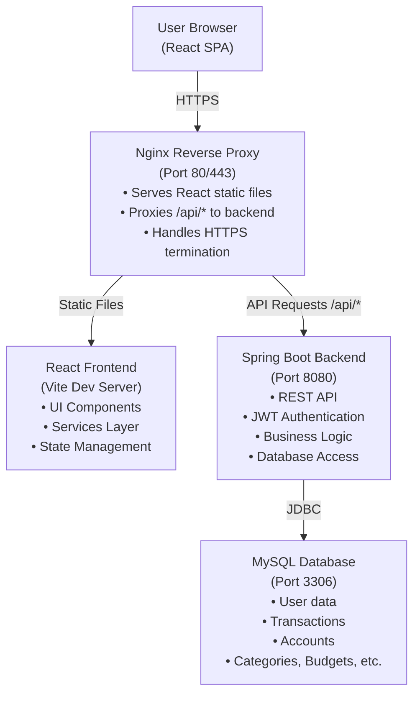
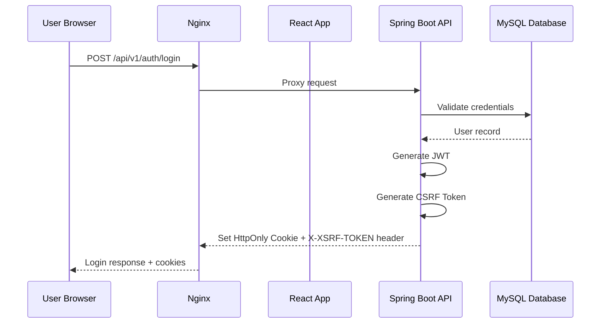
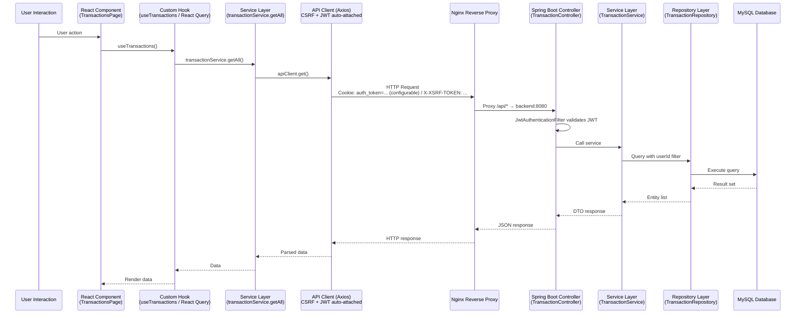
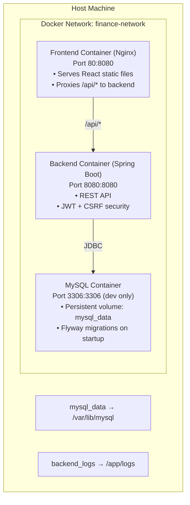

# Finance Tracker - System Architecture

> **Version**: 1.0.0  
> **Last Updated**: December 3, 2025  
> **Status**: Production

---

## Table of Contents

1. [Overview](#overview)
2. [Technology Stack](#technology-stack)
3. [System Architecture](#system-architecture)
4. [Frontend Architecture](#frontend-architecture)
5. [Backend Architecture](#backend-architecture)
6. [Security Architecture](#security-architecture)
7. [Data Flow](#data-flow)
8. [Deployment Architecture](#deployment-architecture)

---

## Overview

This document describes the actual implemented architecture of the Finance Tracker application.

The Finance Tracker is a full-stack personal finance application built with:

- **Frontend**: React 19.2.0 + TypeScript 5.9.3 + Vite 7.2.4
- **Backend**: Spring Boot 3.2.5 + Java 21
- **Database**: MySQL 8.0
- **Deployment**: Docker + Nginx reverse proxy

---

## Technology Stack

### Frontend Stack

| Technology | Version | Purpose |
|------------|---------|---------|
| React | 19.2.0 | UI framework |
| TypeScript | 5.9.3 | Type-safe JavaScript |
| Vite | 7.2.4 | Build tool & dev server |
| TailwindCSS | 4.1.17 | Utility-first CSS framework |
| React Router | 7.9.6 | Client-side routing |
| TanStack Query | 5.90.16 | Server state management |
| React Hook Form | 7.70.0 | Form handling with validation |
| Zod | 4.3.4 | Schema validation |
| Recharts | 3.5.0 | Chart library for data visualization |
| Lucide React | 0.562.0 | Icon library |
| Axios | 1.13.2 | HTTP client |
| date-fns | 4.1.0 | Date manipulation |

### Backend Stack

| Technology | Version | Purpose |
|------------|---------|---------|
| Spring Boot | 3.2.5 | Application framework |
| Spring Security | 6.x | Authentication & authorization |
| Spring Data JPA | 3.2.x | Database access layer |
| Hibernate | 6.x | ORM implementation |
| MySQL | 8.0 | Relational database |
| Flyway | 10.x | Database migrations |
| Lombok | 1.18.30 | Boilerplate reduction |
| MapStruct | 1.5.x | DTO mapping |
| Gradle | 8.x | Build tool |

### Testing Stack

| Technology | Version | Purpose |
|------------|---------|---------|
| JUnit 5 | 5.x | Backend unit testing |
| Mockito | 5.x | Mocking framework |
| AssertJ | 3.x | Fluent assertions |
| Vitest | 4.0.16 | Frontend unit testing |
| React Testing Library | 16.3.0 | Component testing |
| Playwright | 1.57.0 | End-to-end testing |

### Infrastructure

| Technology | Version | Purpose |
|------------|---------|---------|
| Docker | 24.x+ | Containerization |
| Docker Compose | 2.x+ | Multi-container orchestration |
| Nginx | 1.25+ | Reverse proxy & static file server |
| MySQL | 8.0 | Database server |

---

## System Architecture

### High-Level Architecture



### Component Interaction Flow (Login)



---

## Frontend Architecture

### Directory Structure

```
frontend/src/
├── components/
│   ├── ui/                    # 14 reusable UI primitives
│   │   ├── Button.tsx
│   │   ├── Input.tsx
│   │   ├── Select.tsx
│   │   ├── Modal.tsx
│   │   ├── Card.tsx
│   │   └── ...
│   ├── layout/                # Navigation & layout
│   │   ├── AppLayout.tsx
│   │   ├── Sidebar.tsx
│   │   ├── Header.tsx
│   │   └── navigation-config.ts
│   ├── dashboard/             # Dashboard components
│   ├── transactions/          # Transaction components
│   ├── accounts/              # Account components
│   ├── categories/            # Category components
│   ├── budgets/               # Budget components
│   ├── recurring/             # Recurring transaction components
│   └── reports/               # Report components
├── pages/                     # 14 page components
│   ├── auth/
│   │   ├── LoginPage.tsx
│   │   └── RegisterPage.tsx
│   ├── DashboardPage.tsx
│   ├── TransactionsPage.tsx
│   ├── AccountsPage.tsx
│   ├── CategoriesPage.tsx
│   ├── BudgetsPage.tsx
│   ├── RecurringTransactionsPage.tsx
│   ├── ReportsPage.tsx
│   ├── TagsPage.tsx
│   ├── ImportExportPage.tsx
│   ├── AdvancedSearchPage.tsx
│   ├── SettingsPage.tsx
│   └── ProfilePage.tsx
├── services/                  # 15 API service files
│   ├── auth.service.ts
│   ├── account.service.ts
│   ├── transaction.service.ts
│   ├── category.service.ts
│   ├── budget.service.ts
│   ├── recurring-transaction.service.ts
│   ├── dashboard.service.ts
│   ├── exchange-rate.service.ts
│   ├── report.service.ts
│   ├── tag.service.ts
│   ├── currency.service.ts
│   ├── notification.service.ts
│   ├── search.service.ts
│   ├── settings.service.ts
│   └── import-export.service.ts
├── hooks/                     # Custom React hooks
│   ├── useAuth.ts
│   ├── useAccounts.ts
│   ├── useTransactions.ts
│   ├── useCategories.ts
│   ├── useBudgets.ts
│   ├── useDebounce.ts
│   └── useDashboard.ts
├── contexts/                  # React contexts
│   └── AuthContext.tsx
├── lib/                       # Core libraries
│   └── api-client.ts          # Axios instance with CSRF handling
├── types/                     # TypeScript type definitions
│   ├── user.ts
│   ├── account.ts
│   ├── transaction.ts
│   ├── category.ts
│   ├── budget.ts
│   ├── recurring.ts
│   ├── currency.ts
│   └── ...
├── utils/                     # Utility functions
│   ├── formatters.ts          # 8 formatting functions
│   ├── validators.ts          # 13 validation functions
│   └── logger.ts              # Environment-aware logging
├── config/                    # Configuration
│   └── api.ts                 # API endpoints
├── App.tsx                    # Main app component
└── main.tsx                   # Entry point
```

### Architecture Patterns

#### 1. Services Pattern

All API calls go through dedicated service files that use a centralized `apiClient`:

```typescript
// services/transaction.service.ts
export const transactionService = {
  async getAll(filters?: TransactionFilters): Promise<Transaction[]> {
    return apiClient.get<Transaction[]>(ENDPOINTS.TRANSACTIONS, { params: filters });
  },
  
  async create(data: CreateTransactionRequest): Promise<Transaction> {
    return apiClient.post<Transaction>(ENDPOINTS.TRANSACTIONS, data);
  }
};
```

#### 2. Custom Hooks with React Query

Data fetching uses React Query for caching and optimistic updates:

```typescript
// hooks/useTransactions.ts
export function useTransactions(filters?: TransactionFilters) {
  return useQuery({
    queryKey: ['transactions', filters],
    queryFn: () => transactionService.getAll(filters),
  });
}

export function useCreateTransaction() {
  const queryClient = useQueryClient();
  
  return useMutation({
    mutationFn: transactionService.create,
    onSuccess: () => {
      queryClient.invalidateQueries({ queryKey: ['transactions'] });
      queryClient.invalidateQueries({ queryKey: ['dashboard'] });
    },
  });
}
```

#### 3. Component-Based Architecture

- **35+ reusable components** organized by feature
- **Composable UI primitives** (Button, Input, Modal, Card, etc.)
- **Feature components** (TransactionTable, BudgetForm, CategoryTree, etc.)
- **Page components** that orchestrate feature components

#### 4. Type Safety

- **All DTOs match backend** for end-to-end type safety
- **Modular type files** organized by domain (12 type files)
- **Zod schemas** for runtime validation

---

## Backend Architecture

### Directory Structure

```
backend/src/main/java/com/financetracker/
├── controller/                # 14 REST controllers
│   ├── AuthController.java
│   ├── AccountController.java
│   ├── TransactionController.java
│   ├── CategoryController.java
│   ├── BudgetController.java
│   ├── RecurringTransactionController.java
│   ├── DashboardController.java
│   ├── ReportController.java
│   ├── TagController.java
│   ├── CurrencyController.java
│   ├── NotificationController.java
│   ├── SearchController.java
│   ├── ImportExportController.java
│   └── UserSettingsController.java
├── service/                   # Business logic layer
│   ├── AccountService.java
│   ├── AuthService.java
│   ├── AuditLogCleanupService.java
│   ├── BudgetService.java
│   ├── CategoryService.java
│   ├── CurrencyService.java
│   ├── DashboardService.java
│   ├── DemoDataService.java
│   ├── ImportExportService.java
│   ├── NotificationService.java
│   ├── RecurringTransactionService.java
│   ├── ReportService.java
│   ├── SavedSearchService.java
│   ├── TagService.java
│   ├── TokenCleanupService.java
│   ├── TransactionService.java
│   └── UserCurrencyService.java
├── repository/                # Data access layer
│   ├── UserRepository.java
│   ├── AccountRepository.java
│   ├── TransactionRepository.java
│   ├── CategoryRepository.java
│   ├── BudgetRepository.java
│   ├── RecurringTransactionRepository.java
│   ├── TagRepository.java
│   ├── CurrencyRepository.java
│   ├── NotificationRepository.java
│   ├── SavedSearchRepository.java
│   └── ...
├── entity/                    # JPA entities
│   ├── User.java
│   ├── Account.java
│   ├── Transaction.java
│   ├── Category.java
│   ├── Budget.java
│   ├── RecurringTransaction.java
│   ├── Tag.java
│   ├── Currency.java
│   ├── Notification.java
│   └── ...
├── dto/                       # Data Transfer Objects
│   ├── auth/
│   ├── account/
│   ├── transaction/
│   ├── category/
│   ├── budget/
│   └── ...
├── security/                  # Security configuration
│   ├── JwtTokenProvider.java
│   ├── JwtAuthenticationFilter.java
│   ├── UserDetailsServiceImpl.java
│   ├── UserPrincipal.java
│   └── SecurityConfig.java
├── config/                    # Configuration
│   ├── JwtProperties.java
│   ├── CorsProperties.java
│   └── AppConfig.java
├── exception/                 # Exception handling
│   ├── GlobalExceptionHandler.java
│   ├── ApiException.java
│   ├── ErrorCode.java
│   └── TokenHashingException.java
├── specification/             # JPA Specifications
│   └── TransactionSpecification.java
└── FinanceTrackerApplication.java
```

### Architecture Patterns

#### 1. Layered Architecture

**Controller → Service → Repository → Entity**

- **Controllers**: Handle HTTP requests, authentication, validation
- **Services**: Business logic, transactions, orchestration
- **Repositories**: Data access with Spring Data JPA
- **Entities**: JPA entities mapping to database tables

#### 2. DTO Pattern

Separate request/response objects for each endpoint:

```java
// CreateTransactionRequest.java
public class CreateTransactionRequest {
    @NotNull
    private TransactionType type;
    
    @NotNull
    @DecimalMin("0.01")
    private BigDecimal amount;
    
    @NotNull
    private Long accountId;
    
    private Long categoryId;
    // ... validation annotations
}

// TransactionResponse.java
public class TransactionResponse {
    private Long id;
    private TransactionType type;
    private BigDecimal amount;
    private String description;
    private LocalDate transactionDate;
    private AccountResponse account;
    private CategoryResponse category;
    // ... all fields needed by frontend
}
```

#### 3. User Isolation

All queries filter by user ID to ensure data isolation:

```java
@Service
public class TransactionService {
    public Transaction getById(Long userId, Long transactionId) {
        return transactionRepository
            .findByIdAndUserId(transactionId, userId)
            .orElseThrow(() -> new ApiException(ErrorCode.TRANSACTION_NOT_FOUND));
    }
}
```

#### 4. Standardized Error Handling

Centralized exception handling with numeric error codes:

```java
public enum ErrorCode {
    // Authentication (1xxx)
    UNAUTHORIZED(1001, "Invalid credentials"),
    TOKEN_EXPIRED(1002, "Token has expired"),
    
    // Validation (2xxx)
    INVALID_INPUT(2001, "Invalid input"),
    DUPLICATE_ENTRY(2002, "Duplicate entry"),
    
    // Not Found (3xxx)
    TRANSACTION_NOT_FOUND(3001, "Transaction not found"),
    
    // Business Logic (4xxx)
    INSUFFICIENT_BALANCE(4001, "Insufficient balance"),
    
    // Server Errors (5xxx)
    INTERNAL_ERROR(5000, "Internal server error");
}
```

---

## Security Architecture

### Authentication & Authorization

#### JWT-Based Authentication

1. **Login Flow**:

   ```mermaid
   sequenceDiagram
       participant U as User
       participant API as Spring Boot API
       U->>API: POST /api/v1/auth/login
       API->>API: Validate credentials
       API->>API: Generate JWT
       API->>API: Set HttpOnly auth cookie
       API-->>U: Return AuthResponse (user info, flags, etc.)
       U->>API: GET /api/v1/auth/csrf-token
       API->>API: Generate CSRF token
       API-->>U: Return CSRF token (X-XSRF-TOKEN header)
   ```

2. **JWT Token**:
   - Stored in **HttpOnly** cookie (not accessible by JavaScript)
   - **SameSite=Strict** to prevent CSRF
   - **Expiration**: 1 hour (configurable)
   - **Secret**: Validated for production (min 32 characters)

3. **CSRF Protection**:
   - CSRF token fetched via `GET /api/v1/auth/csrf-token` after successful login
   - Frontend (`api-client.ts`) sends the token in `X-XSRF-TOKEN` header for mutating requests
   - Backend validates the CSRF token for all authenticated mutating operations (POST/PUT/DELETE)

#### Password Security

- **BCrypt hashing** with cost factor 12
- **Password requirements**:
  - Minimum 12 characters
  - At least one uppercase letter
  - At least one lowercase letter
  - At least one number
  - At least one special character from `@$!%*?&`

#### Account Lockout

- Maximum 5 failed login attempts
- Account locked for 15 minutes
- Counter resets on successful login

### API Security

#### Request Validation

All requests validated with Bean Validation annotations:

```java
@PostMapping
public ResponseEntity<TransactionResponse> create(
    @AuthenticationPrincipal UserPrincipal userPrincipal,
    @Valid @RequestBody CreateTransactionRequest request) {
    // Validation happens automatically before reaching this point
}
```

#### User Data Isolation

Every query includes user ID filtering:

```java
// Repository layer
Optional<Transaction> findByIdAndUserId(Long id, Long userId);

// Service layer
public Transaction getById(Long userId, Long transactionId) {
    return transactionRepository
        .findByIdAndUserId(transactionId, userId)
        .orElseThrow(() -> new ApiException(ErrorCode.TRANSACTION_NOT_FOUND));
}
```

#### CORS Configuration

Configurable CORS via `application.yml`:

```yaml
cors:
  allowed-origins:
    - http://localhost:5173
    - http://localhost:3000
  allowed-methods:
    - GET
    - POST
    - PUT
    - DELETE
  allowed-headers:
    - "*"
  allow-credentials: true
  max-age: 3600
```

---

## Data Flow

### Request/Response Cycle



### CSRF Token Flow

```mermaid
sequenceDiagram
    participant B as Browser
    participant F as Frontend (Axios / apiClient)
    participant S as Spring Boot Backend

    Note over B,S: 1. Login Request (CSRF-exempt)
    B->>S: POST /api/v1/auth/login<br/>(no CSRF token required by SecurityConfig)
    S->>S: Authenticate user and generate JWT
    S-->>B: Set-Cookie: jwt=eyJhbGci...; HttpOnly; Secure; SameSite=Lax

    Note over B,S: 2. Obtain CSRF token via CookieCsrfTokenRepository
    F->>S: GET /api/v1/auth/csrf-token
    S->>S: CookieCsrfTokenRepository creates or loads CSRF token
    S-->>B: Set-Cookie: XSRF-TOKEN=abc123...; Path=/; SameSite=Lax<br/>Optional JSON body: { "token": "abc123..." }

    Note over F: apiClient reads CSRF token (from XSRF-TOKEN cookie or /csrf-token response)<br/>and will send it as X-XSRF-TOKEN on state-changing requests

    Note over B,S: 3. Subsequent State-Changing Requests
    F->>S: POST /api/v1/transactions<br/>Cookie: jwt=eyJhbGci...; XSRF-TOKEN=abc123...<br/>Header: X-XSRF-TOKEN: abc123...

    Note over S: 4. Backend validation and CSRF exemptions
    S->>S: Permit /api/v1/auth/login and /api/v1/auth/register without CSRF
    S->>S: Validate JWT from cookie (authentication) for protected endpoints
    S->>S: Validate CSRF token using CookieCsrfTokenRepository<br/>(compare X-XSRF-TOKEN header with XSRF-TOKEN cookie)
    S-->>F: Response
```

---

## Deployment Architecture

### Docker Compose Setup



### Environment Profiles

| Profile | Purpose | Database | Frontend URL | Backend URL |
|---------|---------|----------|--------------|-------------|
| `dev` | Local development | localhost:3306 | localhost:5173 | localhost:8080 |
| `docker` | Docker Compose | mysql:3306 | nginx proxy | nginx proxy |
| `prod` | Production | mysql:3306 (no port exposed) | nginx proxy | nginx proxy |

### Health Checks

- **MySQL**: `mysqladmin ping` every 10s
- **Backend**: Spring Boot Actuator `/actuator/health`
- **Frontend**: Nginx health check

---

## Summary

**Key Architectural Decisions:**

1. **Separation of Concerns**: Clear layering (Controller → Service → Repository)
2. **Type Safety**: End-to-end TypeScript types matching backend DTOs
3. **Security First**: JWT in HttpOnly cookies + CSRF tokens
4. **User Isolation**: All queries filter by user ID
5. **Modular Frontend**: 35+ reusable components, organized by feature
6. **Service Pattern**: Centralized API client with automatic CSRF handling
7. **React Query**: Caching and optimistic updates
8. **Docker Deployment**: Multi-container orchestration with health checks
9. **Database Migrations**: Flyway for version-controlled schema changes
10. **Comprehensive Testing**: 103 backend tests, 18 frontend unit tests, 47 E2E tests

This architecture ensures maintainability, security, and scalability for the Finance Tracker application.
