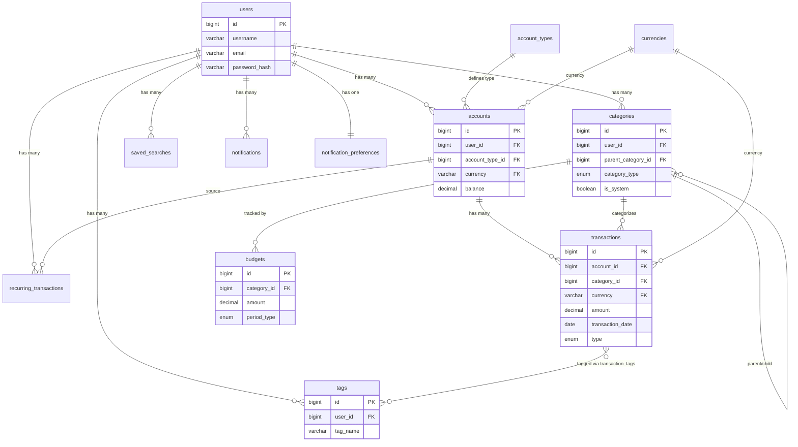

# Finance Tracker - Database Documentation

> **Version**: 1.0.0  
> **Last Updated**: March 18, 2026  
> **Database**: MySQL 8.0  
> **Migration Tool**: Flyway 10.x

---

## Table of Contents

1. [Overview](#overview)
2. [Migration History](#migration-history)
3. [Database Schema](#database-schema)
4. [Table Relationships](#table-relationships)
5. [Indexes](#indexes)
6. [Data Types](#data-types)
7. [Seed Data](#seed-data)

---

## Overview

This document describes the complete database schema for the Finance Tracker application.

The Finance Tracker database uses **MySQL 8.0** with **Flyway** for version-controlled schema migrations. All tables use:

- **Engine**: InnoDB (transactional support)
- **Character Set**: utf8mb4 (full Unicode support including emojis)
- **Collation**: utf8mb4_unicode_ci (case-insensitive)
- **Primary Keys**: BIGINT AUTO_INCREMENT
- **Timestamps**: Automatic created_at/updated_at

**Total Migrations**: 20 (V1-V20)  
**Total Tables**: 14 core tables + 1 junction table + Flyway metadata

---

## Migration History

| Version | File | Description | Date Added |
|---------|------|-------------|------------|
| V1 | `V1__create_users_table.sql` | User accounts with authentication | Initial |
| V2 | `V2__create_account_types_table.sql` | Account type definitions | Initial |
| V3 | `V3__create_accounts_table.sql` | Financial accounts (bank, cash, credit card) | Initial |
| V4 | `V4__create_categories_table.sql` | Hierarchical transaction categories | Initial |
| V5 | `V5__create_transactions_table.sql` | Transaction records | Initial |
| V6 | `V6__create_tags_table.sql` | Transaction tags | Initial |
| V7 | `V7__create_transaction_tags_table.sql` | Transaction-tag many-to-many | Initial |
| V8 | `V8__create_budgets_table.sql` | Budget tracking | Initial |
| V9 | `V9__create_recurring_transactions_table.sql` | Recurring transaction templates | Initial |
| V10 | `V10__create_audit_log_table.sql` | Audit trail for all changes | Initial |
| V11 | `V11__create_revoked_tokens_table.sql` | JWT token revocation | Initial |
| V12 | `V12__seed_default_categories.sql` | Default category seed data | Initial |
| V13 | `V13__create_currencies_table.sql` | Currency definitions with exchange rates | Enhancement |
| V14 | `V14__add_currency_relationships.sql` | Currency data migration | Enhancement |
| V15 | `V15__create_saved_searches_table.sql` | User-saved search filters | Enhancement |
| V16 | `V16__create_notifications_table.sql` | In-app notifications | Enhancement |
| V17 | `V17__create_notification_preferences_table.sql` | User notification settings | Enhancement |
| V18 | `V18__add_additional_currencies.sql` | Additional currency support | Enhancement |
| V19 | `V19__set_npr_as_default_currency.sql` | Set NPR as system default currency | Enhancement |
| V20 | `V20__set_npr_as_default_account_transaction_currency.sql` | Set NPR default for accounts and transactions | Enhancement |

**Deviation from Plan**: Original README.md planned 12 migrations (V1-V12), but 8 additional migrations were added for enhanced features (currencies, saved searches, notifications, NPR default currency).

---

## Database Schema

### Core Tables

#### 1. users

User accounts with authentication and settings.

```sql
CREATE TABLE users (
    id BIGINT PRIMARY KEY AUTO_INCREMENT,
    username VARCHAR(50) NOT NULL,
    email VARCHAR(255) NOT NULL,
    password_hash VARCHAR(255) NOT NULL,
    display_name VARCHAR(100),
    default_currency CHAR(3) DEFAULT 'NPR',
    secondary_currency CHAR(3) DEFAULT NULL,
    timezone VARCHAR(50) DEFAULT 'UTC',
    created_at TIMESTAMP DEFAULT CURRENT_TIMESTAMP,
    updated_at TIMESTAMP DEFAULT CURRENT_TIMESTAMP ON UPDATE CURRENT_TIMESTAMP,
    last_login_at TIMESTAMP NULL,
    failed_login_attempts INT DEFAULT 0,
    locked_until TIMESTAMP NULL,
    
    UNIQUE INDEX idx_users_username (username),
    UNIQUE INDEX idx_users_email (email)
);
```

**Key Fields**:

- `password_hash`: BCrypt hashed password (cost factor 12)
- `failed_login_attempts`: Account lockout tracking (max 5 attempts)
- `locked_until`: Temporary account lock (15 minutes)
- `default_currency`: User's preferred currency (3-letter ISO code); defaults to `NPR` (Nepalese Rupee) after migration V19
- `secondary_currency`: Optional secondary display currency (added by V19); display-only, no data stored in this currency

---

#### 2. account_types

Predefined account type definitions.

```sql
CREATE TABLE account_types (
    id BIGINT PRIMARY KEY AUTO_INCREMENT,
    type_name VARCHAR(50) NOT NULL,
    description VARCHAR(255),
    icon VARCHAR(50),
    color_code VARCHAR(7),
    is_asset BOOLEAN DEFAULT TRUE,
    is_system BOOLEAN DEFAULT FALSE,
    
    UNIQUE INDEX idx_account_types_name (type_name)
);
```

**Predefined Types**: CHECKING, SAVINGS, CREDIT_CARD, CASH, INVESTMENT

---

#### 3. accounts

User financial accounts.

```sql
CREATE TABLE accounts (
    id BIGINT PRIMARY KEY AUTO_INCREMENT,
    user_id BIGINT NOT NULL,
    account_type_id BIGINT NOT NULL,
    account_name VARCHAR(100) NOT NULL,
    institution_name VARCHAR(100),
    account_number_last4 CHAR(4),
    balance DECIMAL(15,2) DEFAULT 0.00,
    currency VARCHAR(3) DEFAULT 'USD',
    color_code VARCHAR(7),
    icon VARCHAR(50),
    is_active BOOLEAN DEFAULT TRUE,
    notes TEXT,
    created_at TIMESTAMP DEFAULT CURRENT_TIMESTAMP,
    updated_at TIMESTAMP DEFAULT CURRENT_TIMESTAMP ON UPDATE CURRENT_TIMESTAMP,
    
    INDEX idx_accounts_user (user_id),
    INDEX idx_accounts_type (account_type_id),
    INDEX idx_accounts_active (user_id, is_active),
    
    CONSTRAINT fk_accounts_user 
        FOREIGN KEY (user_id) REFERENCES users(id) ON DELETE CASCADE,
    CONSTRAINT fk_accounts_type 
        FOREIGN KEY (account_type_id) REFERENCES account_types(id)
);
```

**Key Fields**:

- `balance`: Current account balance (calculated from transactions)
- `currency`: Account currency (originally defaults to USD; changed to `NPR` by migration V20)
- `account_number_last4`: Last 4 digits for identification (optional)

---

#### 4. categories

Hierarchical transaction categories.

```sql
CREATE TABLE categories (
    id BIGINT PRIMARY KEY AUTO_INCREMENT,
    user_id BIGINT,
    parent_id BIGINT,
    category_name VARCHAR(100) NOT NULL,
    category_type ENUM('INCOME', 'EXPENSE') NOT NULL,
    icon VARCHAR(50),
    color_code VARCHAR(7),
    is_system BOOLEAN DEFAULT FALSE,
    created_at TIMESTAMP DEFAULT CURRENT_TIMESTAMP,
    updated_at TIMESTAMP DEFAULT CURRENT_TIMESTAMP ON UPDATE CURRENT_TIMESTAMP,
    
    INDEX idx_categories_user (user_id),
    INDEX idx_categories_parent (parent_id),
    INDEX idx_categories_type (category_type),
    
    CONSTRAINT fk_categories_user 
        FOREIGN KEY (user_id) REFERENCES users(id) ON DELETE CASCADE,
    CONSTRAINT fk_categories_parent 
        FOREIGN KEY (parent_id) REFERENCES categories(id) ON DELETE CASCADE
);
```

**Key Features**:

- **Hierarchical**: Parent categories can have subcategories
- **System Categories**: Seeded default categories (`is_system = TRUE`)
- **Type Restrictions**: Categories are either INCOME or EXPENSE
- **User-Specific**: NULL `user_id` for system categories

---

#### 5. transactions

Transaction records (income, expense, transfers).

```sql
CREATE TABLE transactions (
    id BIGINT PRIMARY KEY AUTO_INCREMENT,
    user_id BIGINT NOT NULL,
    account_id BIGINT NOT NULL,
    category_id BIGINT,
    transaction_type ENUM('INCOME', 'EXPENSE', 'TRANSFER') NOT NULL,
    amount DECIMAL(15,2) NOT NULL,
    currency VARCHAR(3) DEFAULT 'USD',
    transaction_date DATE NOT NULL,
    description VARCHAR(255),
    notes TEXT,
    reference_number VARCHAR(50),
    is_recurring BOOLEAN DEFAULT FALSE,
    recurring_transaction_id BIGINT,
    transfer_to_account_id BIGINT,
    transfer_transaction_id BIGINT,
    created_at TIMESTAMP DEFAULT CURRENT_TIMESTAMP,
    updated_at TIMESTAMP DEFAULT CURRENT_TIMESTAMP ON UPDATE CURRENT_TIMESTAMP,
    
    INDEX idx_transactions_user (user_id),
    INDEX idx_transactions_account (account_id),
    INDEX idx_transactions_category (category_id),
    INDEX idx_transactions_date (transaction_date),
    INDEX idx_transactions_type (transaction_type),
    INDEX idx_transactions_user_date (user_id, transaction_date),
    INDEX idx_transactions_recurring (recurring_transaction_id),
    
    CONSTRAINT fk_transactions_user 
        FOREIGN KEY (user_id) REFERENCES users(id) ON DELETE CASCADE,
    CONSTRAINT fk_transactions_account 
        FOREIGN KEY (account_id) REFERENCES accounts(id) ON DELETE CASCADE,
    CONSTRAINT fk_transactions_category 
        FOREIGN KEY (category_id) REFERENCES categories(id) ON DELETE SET NULL,
    CONSTRAINT fk_transactions_transfer_account 
        FOREIGN KEY (transfer_to_account_id) REFERENCES accounts(id) ON DELETE SET NULL,
    CONSTRAINT fk_transactions_transfer_transaction 
        FOREIGN KEY (transfer_transaction_id) REFERENCES transactions(id) ON DELETE SET NULL
);
```

**Transaction Types**:

- **INCOME**: Money coming in (requires category)
- **EXPENSE**: Money going out (requires category)
- **TRANSFER**: Money moved between accounts (requires `transfer_to_account_id`)

**Transfer Handling**:

- Creates two transactions (debit from source, credit to destination)
- Linked via `transfer_transaction_id`

---

#### 6. tags

Transaction tags for flexible categorization.

```sql
CREATE TABLE tags (
    id BIGINT PRIMARY KEY AUTO_INCREMENT,
    user_id BIGINT NOT NULL,
    tag_name VARCHAR(50) NOT NULL,
    color_code VARCHAR(7),
    
    INDEX idx_tags_user (user_id),
    
    CONSTRAINT fk_tags_user 
        FOREIGN KEY (user_id) REFERENCES users(id) ON DELETE CASCADE,
    CONSTRAINT uq_user_tag UNIQUE (user_id, tag_name)
);
```

---

#### 7. transaction_tags

Many-to-many relationship between transactions and tags.

```sql
CREATE TABLE transaction_tags (
    transaction_id BIGINT NOT NULL,
    tag_id BIGINT NOT NULL,
    
    PRIMARY KEY (transaction_id, tag_id),
    INDEX idx_transaction_tags_tag (tag_id),
    
    CONSTRAINT fk_transaction_tags_transaction 
        FOREIGN KEY (transaction_id) REFERENCES transactions(id) ON DELETE CASCADE,
    CONSTRAINT fk_transaction_tags_tag 
        FOREIGN KEY (tag_id) REFERENCES tags(id) ON DELETE CASCADE
);
```

---

#### 8. budgets

Budget tracking per category/period.

```sql
CREATE TABLE budgets (
    id BIGINT PRIMARY KEY AUTO_INCREMENT,
    user_id BIGINT NOT NULL,
    category_id BIGINT,
    budget_name VARCHAR(100) NOT NULL,
    amount DECIMAL(15,2) NOT NULL,
    period_type ENUM('WEEKLY', 'MONTHLY', 'QUARTERLY', 'YEARLY') DEFAULT 'MONTHLY',
    start_date DATE NOT NULL,
    end_date DATE,
    alert_threshold INT DEFAULT 80,
    alert_enabled BOOLEAN DEFAULT TRUE,
    is_active BOOLEAN DEFAULT TRUE,
    created_at TIMESTAMP DEFAULT CURRENT_TIMESTAMP,
    updated_at TIMESTAMP DEFAULT CURRENT_TIMESTAMP ON UPDATE CURRENT_TIMESTAMP,
    
    INDEX idx_budgets_user (user_id),
    INDEX idx_budgets_category (category_id),
    INDEX idx_budgets_active (user_id, is_active),
    INDEX idx_budgets_dates (start_date, end_date),
    
    CONSTRAINT fk_budgets_user 
        FOREIGN KEY (user_id) REFERENCES users(id) ON DELETE CASCADE,
    CONSTRAINT fk_budgets_category 
        FOREIGN KEY (category_id) REFERENCES categories(id) ON DELETE SET NULL
);
```

**Key Features**:

- **Alert Threshold**: Percentage (default 80%) that triggers notification
- **Period Types**: WEEKLY, MONTHLY, QUARTERLY, YEARLY
- **Nullable Category**: Budget can apply to all categories if NULL

---

#### 9. recurring_transactions

Recurring transaction templates.

```sql
CREATE TABLE recurring_transactions (
    id BIGINT PRIMARY KEY AUTO_INCREMENT,
    user_id BIGINT NOT NULL,
    account_id BIGINT NOT NULL,
    category_id BIGINT,
    transaction_type ENUM('INCOME', 'EXPENSE', 'TRANSFER') NOT NULL,
    amount DECIMAL(15,2) NOT NULL,
    currency VARCHAR(3) DEFAULT 'USD',
    description VARCHAR(255),
    notes TEXT,
    frequency ENUM('DAILY', 'WEEKLY', 'BIWEEKLY', 'MONTHLY', 'QUARTERLY', 'YEARLY') NOT NULL,
    start_date DATE NOT NULL,
    end_date DATE,
    next_occurrence DATE NOT NULL,
    last_processed_date DATE,
    is_active BOOLEAN DEFAULT TRUE,
    transfer_to_account_id BIGINT,
    created_at TIMESTAMP DEFAULT CURRENT_TIMESTAMP,
    updated_at TIMESTAMP DEFAULT CURRENT_TIMESTAMP ON UPDATE CURRENT_TIMESTAMP,
    
    INDEX idx_recurring_user (user_id),
    INDEX idx_recurring_account (account_id),
    INDEX idx_recurring_next (next_occurrence, is_active),
    INDEX idx_recurring_active (user_id, is_active),
    
    CONSTRAINT fk_recurring_user 
        FOREIGN KEY (user_id) REFERENCES users(id) ON DELETE CASCADE,
    CONSTRAINT fk_recurring_account 
        FOREIGN KEY (account_id) REFERENCES accounts(id) ON DELETE CASCADE,
    CONSTRAINT fk_recurring_category 
        FOREIGN KEY (category_id) REFERENCES categories(id) ON DELETE SET NULL,
    CONSTRAINT fk_recurring_transfer_account 
        FOREIGN KEY (transfer_to_account_id) REFERENCES accounts(id) ON DELETE SET NULL
);
```

**Frequency Options**: DAILY, WEEKLY, BIWEEKLY, MONTHLY, QUARTERLY, YEARLY

**Processing**:

- Spring Scheduler checks `next_occurrence` daily
- Creates transaction when due
- Updates `next_occurrence` and `last_processed_date`

---

#### 10. audit_log

Audit trail for all entity changes.

```sql
CREATE TABLE audit_log (
    id BIGINT PRIMARY KEY AUTO_INCREMENT,
    user_id BIGINT NOT NULL,
    entity_type VARCHAR(50) NOT NULL,
    entity_id BIGINT NOT NULL,
    action VARCHAR(20) NOT NULL,
    old_values TEXT,
    new_values TEXT,
    timestamp TIMESTAMP DEFAULT CURRENT_TIMESTAMP,
    
    INDEX idx_audit_user (user_id),
    INDEX idx_audit_entity (entity_type, entity_id),
    INDEX idx_audit_timestamp (timestamp),
    
    CONSTRAINT fk_audit_user 
        FOREIGN KEY (user_id) REFERENCES users(id) ON DELETE CASCADE
);
```

**Actions**: CREATE, UPDATE, DELETE  
**Values**: JSON-serialized before/after state

---

#### 11. revoked_tokens

JWT token revocation list.

```sql
CREATE TABLE revoked_tokens (
    id BIGINT PRIMARY KEY AUTO_INCREMENT,
    token_hash VARCHAR(255) NOT NULL,
    revoked_at TIMESTAMP DEFAULT CURRENT_TIMESTAMP,
    expires_at TIMESTAMP NOT NULL,
    
    UNIQUE INDEX idx_revoked_tokens_hash (token_hash),
    INDEX idx_revoked_tokens_expires (expires_at)
);
```

**Purpose**: Logout functionality (invalidate JWT before expiration)  
**Cleanup**: Expired tokens automatically purged

---

### Enhancement Tables

#### 12. currencies

Currency definitions with exchange rates.

```sql
CREATE TABLE currencies (
    id BIGINT AUTO_INCREMENT PRIMARY KEY,
    code VARCHAR(3) NOT NULL UNIQUE,
    name VARCHAR(100) NOT NULL,
    symbol VARCHAR(10) NOT NULL,
    exchange_rate DECIMAL(20, 10) NOT NULL DEFAULT 1.0,
    last_updated TIMESTAMP NOT NULL DEFAULT CURRENT_TIMESTAMP,
    is_active BOOLEAN NOT NULL DEFAULT TRUE,
    is_base_currency BOOLEAN NOT NULL DEFAULT FALSE,
    created_at TIMESTAMP NOT NULL DEFAULT CURRENT_TIMESTAMP,
    updated_at TIMESTAMP NOT NULL DEFAULT CURRENT_TIMESTAMP ON UPDATE CURRENT_TIMESTAMP,
    
    INDEX idx_code (code),
    INDEX idx_is_active (is_active),
    INDEX idx_is_base_currency (is_base_currency)
);
```

**Seed Data**: 10 default currencies (USD as base)

---

#### 13. saved_searches

User-saved search filters.

```sql
CREATE TABLE saved_searches (
    id BIGINT PRIMARY KEY AUTO_INCREMENT,
    user_id BIGINT NOT NULL,
    search_name VARCHAR(100) NOT NULL,
    search_criteria TEXT,
    is_default BOOLEAN DEFAULT FALSE,
    created_at TIMESTAMP DEFAULT CURRENT_TIMESTAMP,
    updated_at TIMESTAMP DEFAULT CURRENT_TIMESTAMP ON UPDATE CURRENT_TIMESTAMP,
    
    INDEX idx_saved_search_user (user_id),
    
    CONSTRAINT fk_saved_search_user 
        FOREIGN KEY (user_id) REFERENCES users(id) ON DELETE CASCADE,
    CONSTRAINT uq_user_search_name UNIQUE (user_id, search_name)
);
```

**Purpose**: Save complex transaction filters for reuse

---

#### 14. notifications

In-app notifications.

```sql
CREATE TABLE notifications (
    id BIGINT PRIMARY KEY AUTO_INCREMENT,
    user_id BIGINT NOT NULL,
    notification_type VARCHAR(50) NOT NULL,
    title VARCHAR(200) NOT NULL,
    message TEXT,
    priority VARCHAR(20) DEFAULT 'NORMAL',
    is_read BOOLEAN DEFAULT FALSE,
    is_sent BOOLEAN DEFAULT FALSE,
    related_entity_type VARCHAR(50),
    related_entity_id BIGINT,
    action_url VARCHAR(500),
    created_at TIMESTAMP DEFAULT CURRENT_TIMESTAMP,
    read_at TIMESTAMP NULL,
    sent_at TIMESTAMP NULL,
    
    INDEX idx_notification_user (user_id),
    INDEX idx_notification_type (notification_type),
    INDEX idx_notification_read (is_read),
    INDEX idx_notification_created (created_at),
    
    CONSTRAINT fk_notification_user 
        FOREIGN KEY (user_id) REFERENCES users(id) ON DELETE CASCADE
);
```

**Notification Types**: BUDGET_ALERT, RECURRING_TRANSACTION, SYSTEM  
**Priority Levels**: LOW, NORMAL, HIGH

---

#### 15. notification_preferences

User notification settings.

```sql
CREATE TABLE notification_preferences (
    id BIGINT PRIMARY KEY AUTO_INCREMENT,
    user_id BIGINT NOT NULL UNIQUE,
    budget_alerts_enabled BOOLEAN DEFAULT TRUE,
    low_balance_alerts_enabled BOOLEAN DEFAULT TRUE,
    recurring_reminders_enabled BOOLEAN DEFAULT TRUE,
    large_transaction_alerts_enabled BOOLEAN DEFAULT TRUE,
    unusual_spending_alerts_enabled BOOLEAN DEFAULT FALSE,
    monthly_summary_enabled BOOLEAN DEFAULT TRUE,
    email_notifications_enabled BOOLEAN DEFAULT TRUE,
    in_app_notifications_enabled BOOLEAN DEFAULT TRUE,
    low_balance_threshold DECIMAL(15, 2) DEFAULT 100.00,
    large_transaction_threshold DECIMAL(15, 2) DEFAULT 1000.00,
    created_at TIMESTAMP DEFAULT CURRENT_TIMESTAMP,
    updated_at TIMESTAMP DEFAULT CURRENT_TIMESTAMP ON UPDATE CURRENT_TIMESTAMP,
    
    CONSTRAINT fk_notification_pref_user 
        FOREIGN KEY (user_id) REFERENCES users(id) ON DELETE CASCADE
);
```

---

## Table Relationships



---

## Indexes

### Performance Optimization

All tables include strategic indexes for:

1. **Foreign Keys**: All foreign key columns indexed
2. **User Filtering**: `user_id` indexed on all user-owned tables
3. **Date Ranges**: Transaction and budget date columns
4. **Composite Indexes**: `(user_id, is_active)`, `(user_id, transaction_date)`
5. **Unique Constraints**: `(user_id, tag_name)`, `(user_id, search_name)`

### Index Coverage

- **Total Indexes**: 50+ across all tables
- **Foreign Key Indexes**: 25+
- **Unique Indexes**: 8
- **Composite Indexes**: 10+

---

## Data Types

### Precision Standards

| Data Type | Usage | Precision |
|-----------|-------|-----------|
| `DECIMAL(15,2)` | Money amounts, balances | 2 decimal places, up to 999,999,999,999.99 |
| `DECIMAL(20,10)` | Exchange rates | 10 decimal places for accuracy |
| `VARCHAR(3)` | Currency codes | ISO 4217 (USD, EUR, GBP) |
| `CHAR(4)` | Account last 4 digits | Fixed length |
| `ENUM` | Fixed value sets | Transaction types, frequencies, etc. |
| `BIGINT` | IDs | Supports 9.2 quintillion records |
| `TEXT` | Long-form content | Notes, descriptions, JSON |
| `TIMESTAMP` | Dates with time | UTC storage, timezone-aware |
| `DATE` | Dates only | Transaction dates, budget dates |

---

## Seed Data

### Default Categories (V12)

```sql
INSERT INTO categories (category_name, category_type, icon, color_code, is_system)
VALUES
  -- INCOME categories
  ('Salary', 'INCOME', 'briefcase', '#10B981', TRUE),
  ('Business Income', 'INCOME', 'building', '#059669', TRUE),
  ('Freelance', 'INCOME', 'laptop', '#34D399', TRUE),
  ('Investments', 'INCOME', 'trending-up', '#6366F1', TRUE),
  ('Other Income', 'INCOME', 'dollar-sign', '#8B5CF6', TRUE),
  
  -- EXPENSE categories (top-level)
  ('Food & Dining', 'EXPENSE', 'utensils', '#EF4444', TRUE),
  ('Transportation', 'EXPENSE', 'car', '#F59E0B', TRUE),
  ('Shopping', 'EXPENSE', 'shopping-bag', '#EC4899', TRUE),
  ('Entertainment', 'EXPENSE', 'film', '#8B5CF6', TRUE),
  ('Bills & Utilities', 'EXPENSE', 'file-text', '#3B82F6', TRUE),
  ('Health & Fitness', 'EXPENSE', 'heart', '#10B981', TRUE),
  ('Education', 'EXPENSE', 'book', '#06B6D4', TRUE),
  ('Travel', 'EXPENSE', 'plane', '#F97316', TRUE),
  ('Personal Care', 'EXPENSE', 'user', '#A855F7', TRUE),
  ('Other Expenses', 'EXPENSE', 'more-horizontal', '#6B7280', TRUE);
```

### Default Currencies (V13)

10 currencies seeded: USD (base), EUR, GBP, JPY, CHF, CAD, AUD, CNY, INR, MXN

---

## Summary

**Database Highlights:**

- ✅ **20 Flyway migrations** (8 more than originally planned)
- ✅ **15 tables** (14 core + 1 junction table)
- ✅ **Full user data isolation** via foreign keys
- ✅ **Hierarchical categories** with parent/child relationships
- ✅ **Robust indexing** for performance
- ✅ **DECIMAL precision** for financial accuracy
- ✅ **Audit logging** for all changes
- ✅ **JWT revocation** support
- ✅ **Currency support** with exchange rates
- ✅ **Notification system** with preferences
- ✅ **Saved searches** for power users

**Deviations from Plan:**

- Added V13-V20 for currencies, saved searches, notifications, and NPR default currency
- No changes to original V1-V12 structure
