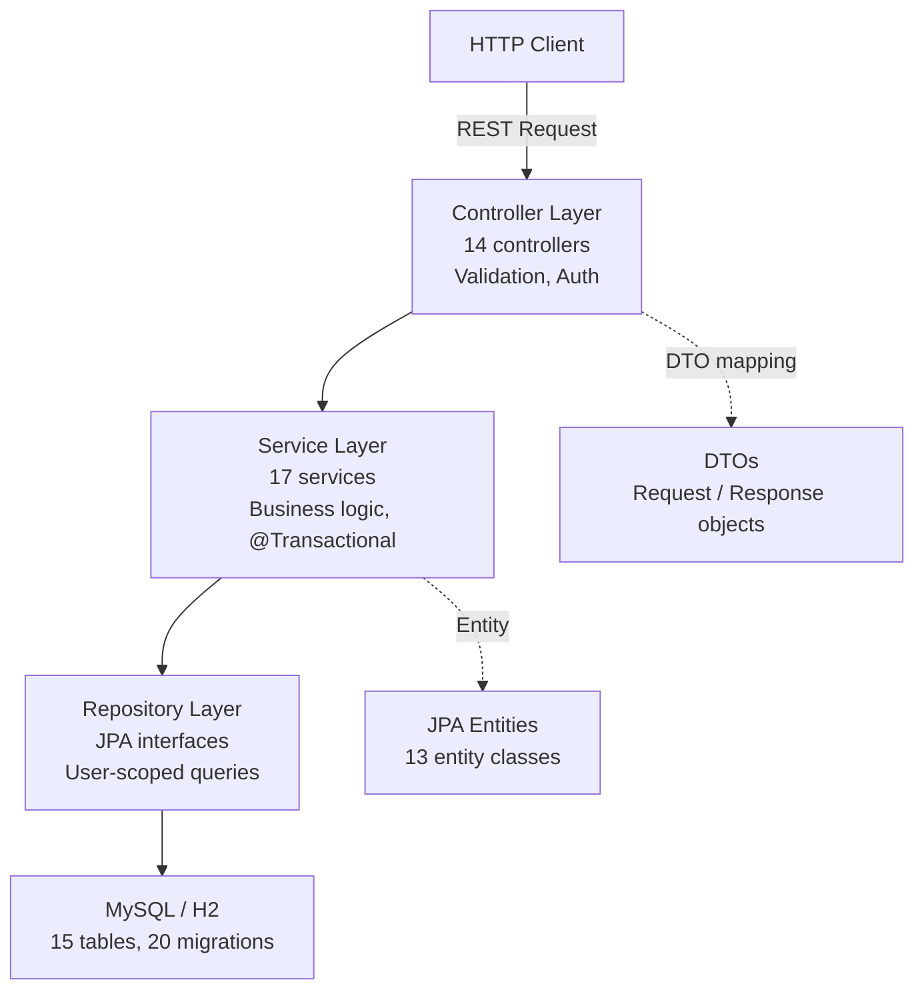

# Backend Development Guide

> **Version**: 1.0.0  
> **Last Updated**: December 4, 2025  
> **Audience**: Backend Developers

---

## Table of Contents

- [Backend Development Guide](#backend-development-guide)
  - [Table of Contents](#table-of-contents)
  - [Overview](#overview)
  - [Stack \& Architecture](#stack--architecture)
    - [Controllers (14)](#controllers-14)
    - [DTO Pattern](#dto-pattern)
  - [Security (JWT + CSRF)](#security-jwt--csrf)
  - [Error Handling](#error-handling)
  - [Flyway Migrations](#flyway-migrations)
  - [User Data Isolation](#user-data-isolation)
  - [Adding a New Endpoint](#adding-a-new-endpoint)
  - [Testing](#testing)
  - [Best Practices](#best-practices)

---

## Overview

This document describes the Spring Boot 3.2.x + Java 21 backend of Finance Tracker, reflecting the current code under `backend/src/main/java/com/financetracker/`. It covers architecture, security, DTOs, migrations, isolation, testing, and how to add endpoints.

---

## Stack & Architecture

- Spring Boot 3.2.x, Java 21
- JPA/Hibernate with MySQL (dev/test profiles as in `copilot-instructions.md`)
- Layered architecture: Controller → Service → Repository → Entity



- Package layout:
  - `controller/` (14 controllers)
  - `service/` (business logic)
  - `repository/` (Spring Data JPA interfaces)
  - `entity/` (JPA entities)
  - `dto/` (request/response DTOs)
  - `security/` (JWT, principal, filter)
  - `exception/` (ErrorCode, global handler)
  - `specification/` (query specifications for filtering/search)
  - `config/` (app-level configuration)

### Controllers (14)

Located in `backend/src/main/java/com/financetracker/controller/`:

- `AccountController.java`
- `AuthController.java`
- `BudgetController.java`
- `CategoryController.java`
- `CurrencyController.java`
- `DashboardController.java`
- `ImportExportController.java`
- `NotificationController.java`
- `RecurringTransactionController.java`
- `ReportController.java`
- `SearchController.java`
- `TagController.java`
- `TransactionController.java`
- `UserSettingsController.java`

Controllers follow a standardized pattern: inject `@AuthenticationPrincipal UserPrincipal` to get `userId`, validate requests with DTOs, delegate to services, and return typed responses.

### DTO Pattern

- All request/response models live under `dto/` with validation annotations (e.g., `@NotNull`, `@Size`).
- Controllers accept request DTOs via `@Valid @RequestBody` and return response DTOs, never exposing entities directly.

Example controller pattern:

```java
@PostMapping
public ResponseEntity<TransactionResponse> create(
    @AuthenticationPrincipal UserPrincipal userPrincipal,
    @Valid @RequestBody CreateTransactionRequest request
) {
    return ResponseEntity.status(HttpStatus.CREATED)
        .body(transactionService.create(userPrincipal.getId(), request));
}
```

## Security (JWT + CSRF)

- JWT issued to authenticated users and stored in HttpOnly cookie named `auth_token`.
- `security/JwtAuthenticationFilter.java` parses tokens; `JwtTokenProvider.java` handles sign/verify.
- `security/UserPrincipal.java` carries `id` and authorities; injected via `@AuthenticationPrincipal`.
- CSRF: frontend sends `X-XSRF-TOKEN` header; backend validates per Spring Security configuration.

## Error Handling

- Centralized error codes in `exception/ErrorCode.java` with ranges:
  - 1xxx = Auth errors
  - 2xxx = Validation errors
  - 3xxx = Not-found errors
  - 4xxx = Business rule errors
  - 5xxx = Server errors
- `exception/GlobalExceptionHandler.java` maps exceptions to consistent API responses.

## Flyway Migrations

- Location: `backend/src/main/resources/db/migration/`
- Total: 20 files (`V1`–`V20`)
- Examples include:
  - `V1__create_users_table.sql`
  - `V5__create_transactions_table.sql`
  - `V8__create_budgets_table.sql`
  - `V12__seed_default_categories.sql` (system categories)
  - `V16__create_notifications_table.sql`

Rules:

- Never modify existing `V*.sql`; add a new version for each schema change.
- Keep migrations atomic and reversible when feasible.

## User Data Isolation

- All repository queries and service methods must filter by `userId`.
- Controllers always derive `userId` from `UserPrincipal` and pass it into services.
- DTO mappers must not leak cross-user references.
- System categories are flagged (`isSystem=true`) and not user-editable.

## Adding a New Endpoint

Example: Adding Savings Goals API (`/api/v1/goals`).

1. Create entities under `entity/Goal.java` with proper relationships.
2. Add Flyway migration: `V21__create_goals_table.sql` defining schema.
3. Define DTOs in `dto/goal/` (`CreateGoalRequest`, `GoalResponse`, `UpdateGoalRequest`) with validation.
4. Add repository: `repository/GoalRepository.java` with user-scoped queries (e.g., `findAllByUserId`).
5. Implement service: `service/GoalService.java` with `@Transactional` for writes and business rules.
6. Create controller: `controller/GoalController.java` under `/api/v1/goals`, inject `@AuthenticationPrincipal UserPrincipal`.
7. Wire security if needed (roles/authorities) and verify CSRF for mutating operations.
8. Write integration tests extending `BaseIntegrationTest` to verify authenticated flow.

Controller template:

```java
@RestController
@RequestMapping("/api/v1/goals")
public class GoalController {
  private final GoalService goalService;
  public GoalController(GoalService goalService) { this.goalService = goalService; }

  @PostMapping
  public ResponseEntity<GoalResponse> create(
      @AuthenticationPrincipal UserPrincipal userPrincipal,
      @Valid @RequestBody CreateGoalRequest request
  ) {
    return ResponseEntity.status(HttpStatus.CREATED)
        .body(goalService.create(userPrincipal.getId(), request));
  }

  @GetMapping
  public List<GoalResponse> list(@AuthenticationPrincipal UserPrincipal userPrincipal) {
    return goalService.list(userPrincipal.getId());
  }
}
```

## Testing

- Use `BaseIntegrationTest` to set up authenticated tests with H2 test profile.
- Pattern:

```java
@Test
void testEndpoint() throws Exception {
  Cookie authCookie = registerAndLogin("user", "user@test.com", "SecureP@ssw0rd!");
  mockMvc.perform(get("/api/v1/endpoint").cookie(authCookie))
      .andExpect(status().isOk());
}
```

-- Run tests:

```
cd backend && ./gradlew test --tests "*ControllerIntegrationTest"
```

## Best Practices

- Controller methods are thin; push business logic into services.
- Always validate DTO inputs; use `@Valid` and constraint annotations.
- Scope all queries by `userId` to enforce isolation.
- Use `@Transactional` on write operations; keep transactions short.
- Return DTOs, not entities; map in services or dedicated mappers.
- Keep consistent error codes via `ErrorCode` and handle in `GlobalExceptionHandler`.
- Add specs (`specification/`) for complex filters/search; avoid ad-hoc query construction.
- Evolve schema via Flyway with new `V*` files; never edit old migrations.
- Keep JWT in HttpOnly cookies; ensure CSRF token validation on mutating endpoints.
