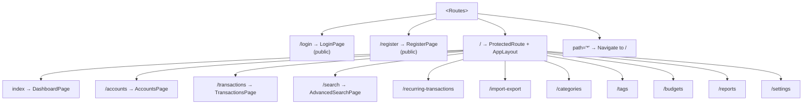

# Frontend Development Guide

> **Version**: 1.0.0  
> **Last Updated**: March 18, 2026  
> **Audience**: Frontend Developers

---

## Table of Contents

1. [Stack & Architecture](#stack--architecture)
2. [Adding a New Frontend Feature](#adding-a-new-frontend-feature)
3. [Best Practices](#best-practices)
4. [Security & Auth Details](#security--auth-details)
5. [Environment Configuration](#environment-configuration)

---

## Overview

This document describes the React/TypeScript frontend of Finance Tracker, reflecting the current code under `frontend/src/`. It covers architecture, components, services, hooks, types, utilities, routing, state management, and how to add new features.

---

## Stack & Architecture

- React 19.x + Vite + TypeScript
- Directory: `frontend/src/`
- Key folders: `components/`, `pages/`, `services/`, `hooks/`, `types/`, `utils/`, `lib/`, `config/`, `contexts/`
- API client: centralized Axios instance with CSRF handling in `lib/api-client.ts` (injects `X-XSRF-TOKEN`, redirects on 401)

### Pages

There are 14 pages (12 main + 2 auth):

- `pages/AccountsPage.tsx`
- `pages/AdvancedSearchPage.tsx`
- `pages/BudgetsPage.tsx`
- `pages/CategoriesPage.tsx`
- `pages/DashboardPage.tsx`
- `pages/ImportExportPage.tsx`
- `pages/ProfilePage.tsx`
- `pages/RecurringTransactionsPage.tsx`
- `pages/ReportsPage.tsx`
- `pages/SettingsPage.tsx`
- `pages/TagsPage.tsx`
- `pages/TransactionsPage.tsx`
- `pages/auth/LoginPage.tsx`, `pages/auth/RegisterPage.tsx` (auth group)

### Routing Structure

Routes are defined as top-level siblings in `App.tsx`. `/login` and `/register` are public, while `/` wraps all protected pages via `ProtectedRoute`:



### Components

Component library is organized by feature and role:

- `components/ui/`: Reusable UI primitives (buttons, inputs, status chips, etc.)
- `components/layout/`: Structural wrappers and `MainLayout.tsx`
- `components/dashboard/`: Dashboard widgets/cards, summary blocks
- `components/transactions/`: Transaction lists, editors, filters
- `components/accounts/`, `components/budgets/`, `components/categories/`, `components/recurring/`, `components/reports/`: Feature-specific components
- Utilities: `ProtectedRoute.tsx`, `NotificationCenter.tsx`, `CurrencyConverter.tsx`

The repo contains 35+ React components across the above folders. Common layout and route-protection pieces live at the root of `components/`.

### Services Pattern

All API calls go through service modules using a shared `apiClient`:

- Location: `src/services/*.service.ts`
- Examples: `account.service.ts`, `auth.service.ts`, `budget.service.ts`, `category.service.ts`, `currency.service.ts`, `dashboard.service.ts`, `exchange-rate.service.ts`, `import-export.service.ts`, `notification.service.ts`, `recurring-transaction.service.ts`, `report.service.ts`, `search.service.ts`, `settings.service.ts`, `tag.service.ts`, `transaction.service.ts` (15 total)
- `apiClient`: `src/lib/api-client.ts` handles base URL (`VITE_API_BASE_URL`), cookies, and CSRF interceptor as documented in `docs/api/API_REFERENCE.md` and `copilot-instructions.md`.

Service example pattern:

```typescript
// src/services/account.service.ts
import { ENDPOINTS } from '@/config/api';
import { apiClient } from '@/lib/api-client';
import type { Account, CreateAccountRequest } from '@/types/account';

export const accountService = {
  async list(): Promise<Account[]> {
    return apiClient.get<Account[]>(ENDPOINTS.ACCOUNTS);
  },
  async create(data: CreateAccountRequest): Promise<Account> {
    return apiClient.post<Account>(ENDPOINTS.ACCOUNTS, data);
  },
  async update(id: string, data: Partial<CreateAccountRequest>): Promise<Account> {
    return apiClient.put<Account>(`${ENDPOINTS.ACCOUNTS}/${id}`, data);
  },
  async remove(id: string): Promise<void> {
    return apiClient.delete<void>(`${ENDPOINTS.ACCOUNTS}/${id}`);
  },
};
```

### Custom Hooks (React Query)

Feature hooks encapsulate fetching/mutations via React Query:

- Location: `src/hooks/`
- Available hooks: `useAccounts.ts`, `useAuth.ts`, `useBudgets.ts`, `useCategories.ts`, `useDashboard.ts`, `useDebounce.ts`, `useTransactions.ts`

Typical pattern:

```typescript
// src/hooks/useTransactions.ts
import { useQuery, useMutation, useQueryClient } from '@tanstack/react-query';
import { transactionService } from '@/services/transaction.service';

export function useTransactions() {
  const queryClient = useQueryClient();
  const transactionsQuery = useQuery({ queryKey: ['transactions'], queryFn: transactionService.list });
  const createTransaction = useMutation({
    mutationFn: transactionService.create,
    onSuccess: () => queryClient.invalidateQueries({ queryKey: ['transactions'] }),
  });
  return { transactionsQuery, createTransaction };
}
```

### Type System

Type definitions are modularized under `src/types/` (12 files total):

- `account.ts`, `api.ts`, `budget.ts`, `category.ts`, `common.ts`, `currency.ts`, `index.ts`, `notification.ts`, `recurring.ts`, `reports.ts`, `transaction.ts`, `user.ts`
- These types are used across services and hooks for strict typing of requests/responses.

### Utilities

Location: `src/utils/`

- `formatters.ts` (8 functions): `formatCurrency`, `formatDate`, `formatRelativeDate`, `formatNumber`, `formatPercentage`, `formatFileSize`, `truncate`, `getInitials`
- `validators.ts` (13 functions): `isValidEmail`, `isValidPassword`, `getPasswordStrength`, `isValidAmount`, `isValidDate`, `isRequired`, `minLength`, `maxLength`, `minValue`, `maxValue`, `isValidPhoneNumber`, `isValidUrl`, `sanitizeString`
- `constants.ts`, `logger.ts`

### Routing & Protected Routes

- App entry: `src/main.tsx` mounts `App.tsx`
- Router is configured in `App.tsx` and page components under `src/pages/`
- `components/ProtectedRoute.tsx` wraps routes that require authentication. It reads from `AuthContext` and redirects unauthenticated users to `/login`.
- `components/MainLayout.tsx` defines shared layout (header, navigation, content container).

### State Management

- Auth state via `src/contexts/AuthContext.tsx` and `hooks/useAuth.ts`
- Server state via React Query (used in feature hooks: accounts, transactions, budgets, dashboard)
- `apiClient` injects CSRF token automatically and redirects on 401 to login per `lib/api-client.ts`.

## Adding a New Frontend Feature

Follow this step-by-step flow to add a feature (e.g., Savings Goals):

1. Define types in `src/types/goal.ts` and export from `types/index.ts`.
2. Add endpoint constants to `src/config/api.ts` (`ENDPOINTS.GOALS`).
3. Create `src/services/goal.service.ts` using `apiClient` with list/create/update/delete.
4. Implement hooks in `src/hooks/useGoals.ts` with React Query for `query` and mutations.
5. Build components in `src/components/goals/` and page `src/pages/GoalsPage.tsx`.
6. Register route in `App.tsx` (protected) and wire into `MainLayout` navigation.
7. Use validators/formatters from `src/utils` for input and display.
8. Add tests under `src/components/__tests__/` and/or e2e in `frontend/e2e`.

## Best Practices

- Keep API calls in services only; components use hooks.
- Use React Query for caching, optimistic updates, and invalidations.
- Leverage `AuthContext` and `ProtectedRoute` to guard pages.
- Prefer typed DTOs in `types/` for request/response contracts.
- Reuse UI primitives in `components/ui/` and compose feature components.
- Centralize routing changes in `App.tsx` and `MainLayout.tsx`.
- Keep utilities pure and side-effect free; add unit tests for validators/formatters.
- Avoid duplicating business rules in the UI; defer to backend for enforcement.
- Ensure CSRF headers are present on write operations (handled by `apiClient`).

## Security & Auth Details

- Backend sets HttpOnly cookie `auth_token` on login; do not attempt to read it in the browser.
- CSRF handled via axios interceptor (`X-XSRF-TOKEN` automatically added).
- Password policy enforced server-side: min 12 chars, includes uppercase, lowercase, digit, and one special from `@$!%*?&`.

## Environment Configuration

- Endpoints: `src/config/api.ts` defines `ENDPOINTS` under `/api/v1`.
- Base URL `VITE_API_BASE_URL`:
  - Local dev: defaults to `http://localhost:8080`
  - Docker/nginx: set to empty string to use proxy (`/api/*` via nginx)
