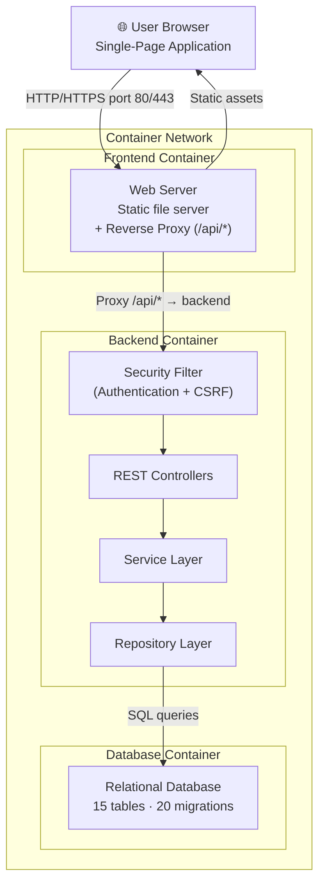
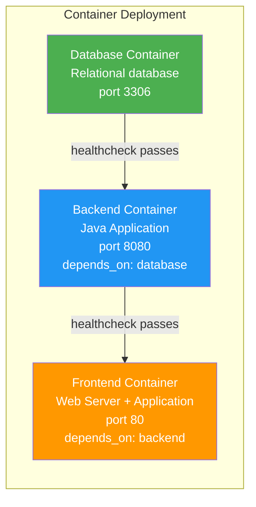
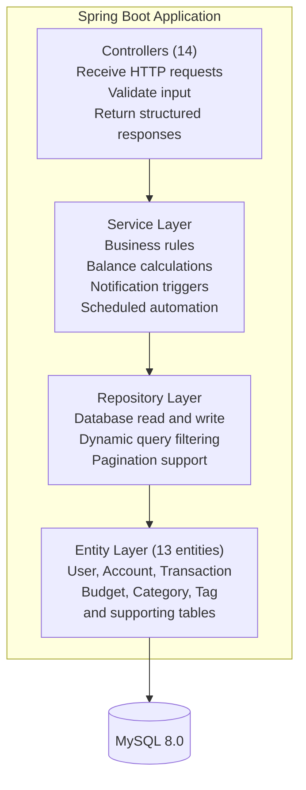
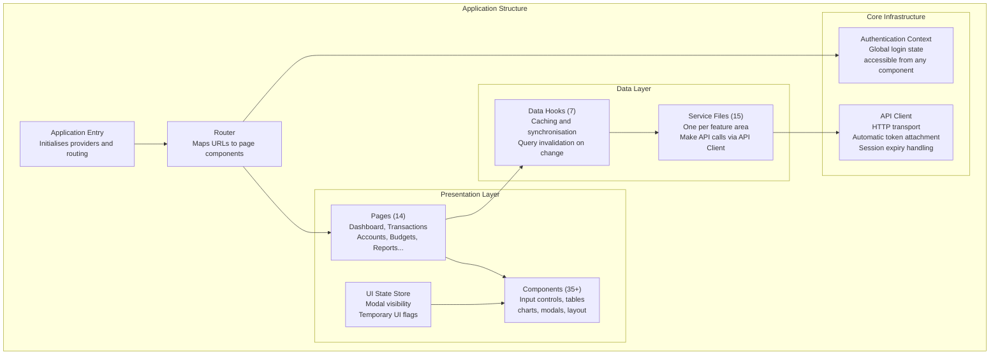
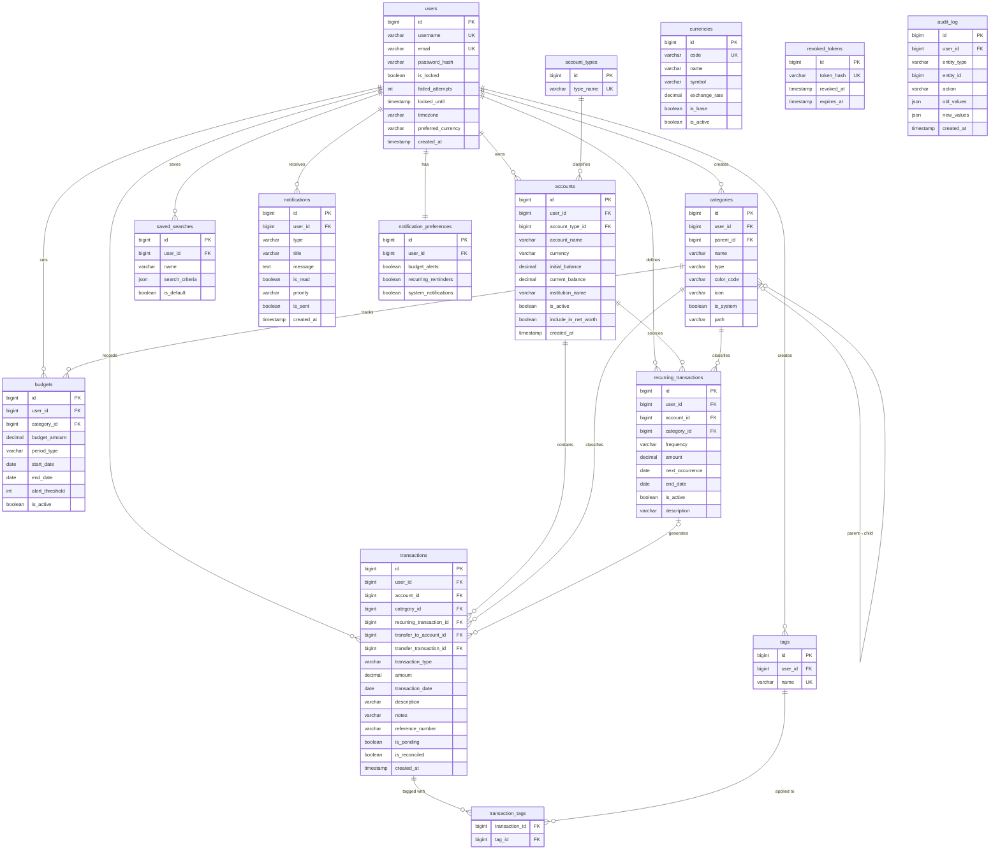

# Chapter 4 — System Design & Architecture

> **Report Navigation:** [← Chapter 3](./CH03_REQUIREMENTS.md) | [Index](./README.md) | [Chapter 5 →](./CH05_IMPLEMENTATION.md)

---

## 4.1 Introduction

This chapter documents the architectural decisions, system diagrams, database design, and technology choices that form the foundation of Finance Tracker. The design follows a **three-tier layered architecture** with a clear separation between presentation, business logic, and data layers, all deployed as Docker containers.

---

## 4.2 Technology Stack Selection

### 4.2.1 Frontend Stack

**Table 4.1 — Frontend Technology Stack**

| Technology | Version | Justification |
|------------|---------|---------------|
| **React** | 19.2.0 | Industry-leading component framework for building interactive user interfaces |
| **TypeScript** | 5.9.3 | Typed superset of JavaScript; catches data shape errors at development time |
| **Vite** | 7.2.4 | Modern build tool providing fast development refresh and optimised production output |
| **Tailwind CSS** | 4.1.17 | Utility-based styling system enabling consistent, responsive design without custom CSS |
| **React Router** | 7.9.6 | Client-side routing for the single-page application navigation model |
| **TanStack Query** | 5.90.16 | Server-state management with built-in caching, background synchronisation, and deduplication |
| **React Hook Form** | 7.70.0 | Performant form state management with minimal component re-rendering |
| **Zod** | 4.3.4 | Schema-first validation library; validates both at runtime and generates TypeScript types |
| **Recharts** | 3.5.0 | Composable, declarative charting library for financial visualisations |
| **Axios** | 1.13.2 | HTTP client with request and response interceptor support for automated token handling |
| **Zustand** | 5.0.8 | Lightweight global state management for UI-level shared state |
| **Lucide React** | 0.562.0 | Consistent, accessible icon library with minimal bundle footprint |
| **date-fns** | 4.1.0 | Modular date manipulation library covering all required formatting and calculation needs |

### 4.2.2 Backend Stack

**Table 4.2 — Backend Technology Stack**

| Technology | Version | Justification |
|------------|---------|---------------|
| **Spring Boot** | 3.2.5 | Widely-adopted Java web application framework with comprehensive auto-configuration |
| **Spring Security** | 6.x | Enterprise-grade security framework; selected for its robust JWT filter chain and CSRF support |
| **Spring Data JPA** | 3.2.x | Data access abstraction layer with built-in pagination and dynamic query support |
| **Hibernate** | 6.x | Object-relational mapper; eliminates most handwritten SQL for standard operations |
| **MySQL** | 8.0 | Proven, ACID-compliant relational database management system |
| **Flyway** | 10.x | Version-controlled incremental database migration tool |
| **Lombok** | 1.18.30 | Annotation-based code generation to reduce repetitive boilerplate in entity classes |
| **JJWT** | 0.12.5 | Authentication token generation and validation library |
| **BCrypt** | Spring Security built-in | Industry-standard adaptive password hashing algorithm |
| **Gradle** | 8.x | Flexible build system and dependency management tool |

---

## 4.3 High-Level System Architecture

**Figure 4.1 — System Architecture Overview**

### 4.3.1 Application Container Stack

**Figure 4.2 — Application Container Stack**

Three containers communicate over an internal bridge network:

| Container | Role | Internal Port |
|-----------|------|---------------|
| Database | Relational database storing all application data | 3306 |
| Backend | Java application serving the REST API | 8080 |
| Frontend | Web server delivering the application and proxying API calls | 80 |

Health checks ensure each container waits for its dependency to be ready before accepting connections.

---

## 4.4 Backend Architecture

### 4.4.1 Layered Architecture

**Figure 4.3 — Backend Layered Architecture**

### 4.4.2 Security Architecture

Every incoming request passes through a two-stage security check before reaching any application logic:

**Stage 1 — Authentication verification:** The system reads the authentication token from the browser cookie attached to the request. It verifies the token's digital signature, confirms it has not expired, and checks the server-side revocation list to ensure it has not been invalidated by a previous logout. If any check fails, the request is rejected with a 401 (Unauthorised) response.

**Stage 2 — Cross-site request forgery protection:** For any request that modifies data (create, update, or delete operations), the system also checks for a separately issued security token in the request header. Ordinary browser navigation or a forged request from another website cannot include this header token, so such requests are rejected with a 403 (Forbidden) response. Read-only requests (data retrieval) are not subject to this check.

If both checks pass, the authenticated user's identity is made available to the controller, and all subsequent database queries are automatically scoped to that user's data.

**Table 4.5 — Authentication Token Properties**

| Property | Configuration |
|----------|---------------|
| Storage mechanism | Browser cookie inaccessible to page scripts |
| Transmission security | Flagged to prevent transmission over unencrypted connections |
| Cross-site protection | Configured to prevent the cookie being sent on cross-origin requests |
| Default expiry | 1 hour |
| Extended expiry (Remember Me) | 30 days |
| Signing algorithm | Cryptographic hash-based message authentication (HMAC) |

### 4.4.3 Controllers Overview

| Feature Area | Endpoint Count |
|-------------|---------------|
| Authentication and user profile | 7 |
| Financial accounts | 7 |
| Transactions | 5 |
| Categories | 5 |
| Budgets | 7 |
| Recurring transactions | 6 |
| Tags | 5 |
| Dashboard summary | 1 |
| Financial reports | 2 |
| Data import and export | 2 |
| Currencies | 9 |
| Notifications | 9 |
| Advanced search | 7 |
| User settings | 1 |
| **Total** | **73 endpoints** |

---

## 4.5 Frontend Architecture

### 4.5.1 Application Layer Structure

**Figure 4.4 — Frontend Application Layer Diagram**

### 4.5.2 Data Flow Pattern

When a user navigates to a page that displays data, the following sequence occurs:

1. The page component requests data through a data hook.
2. The hook checks whether a sufficiently recent copy is already cached in memory.
3. If the data is fresh (within 30 seconds), it is returned from the cache immediately — no network request is made.
4. If the data is stale or absent, the hook calls the appropriate service function.
5. The service function passes the request to the API client, which attaches the authentication cookie and security token automatically.
6. The request travels through the web server proxy to the backend application, which queries the database and returns the response.
7. The response is stored in the cache and returned to the page component, which re-renders with the new data.

When the user creates, modifies, or deletes a record, the hook invalidates the relevant cached queries, triggering a background refresh so that the interface remains consistent with the server's actual state.

---

## 4.6 Database Design

### 4.6.1 Entity Relationship Diagram

**Figure 4.5 — Entity Relationship Diagram**

### 4.6.2 Database Tables Summary

**Table 4.3 — Database Tables (V1–V20 Migrations)**

| Table | Migration | Primary Purpose |
|-------|-----------|----------------|
| `users` | V1 | User accounts; auth, lockout tracking |
| `account_types` | V2 | Lookup: CHECKING, SAVINGS, CREDIT_CARD, CASH, INVESTMENT, LOAN |
| `accounts` | V3 | Financial accounts per user |
| `categories` | V4 | Hierarchical categories (INCOME/EXPENSE), self-referencing |
| `transactions` | V5 | All financial movements; supports INCOME, EXPENSE, TRANSFER |
| `tags` | V6 | User-defined labels for transactions |
| `transaction_tags` | V7 | Many-to-many junction: transactions ↔ tags |
| `budgets` | V8 | Period-based spending limits with alert threshold |
| `recurring_transactions` | V9 | Templates for automated periodic transactions |
| `audit_log` | V10 | Immutable record of entity changes |
| `revoked_tokens` | V11 | Token blocklist for secure logout |
| `(seed)` | V12 | Default categories seeded (INCOME: Salary, Freelance…; EXPENSE: Food, Transport…) |
| `currencies` | V13 | ISO 4217 currency definitions + exchange rates |
| `(data)` | V14 | Currency relationship data migration |
| `saved_searches` | V15 | Persisted search queries per user |
| `notifications` | V16 | In-app notification records |
| `notification_preferences` | V17 | Per-user notification type settings |
| `(data)` | V18 | Additional currencies inserted |
| `(data)` | V19 | NPR set as default system currency |
| `(data)` | V20 | NPR default applied to accounts and transactions |

### 4.6.3 Transactions Table Key Design Decisions

- **`transaction_type ENUM('INCOME','EXPENSE','TRANSFER')`** — three-value discriminator column.
- **`transfer_to_account_id`** and **`transfer_transaction_id`** — self-reference to link the two halves of a transfer.
- **`recurring_transaction_id`** — links auto-created transactions back to their template.
- **`DECIMAL(15,2)`** for all monetary columns — no floating-point precision loss.
- **`is_pending`, `is_reconciled`, `is_void`** — lifecycle flags for transaction state.

### 4.6.4 Category Hierarchical Design

Categories support a two-level hierarchy — a parent category can have multiple subcategories (for example, "Food" → "Groceries" and "Restaurants"). Each category stores its full ancestor path as a text string alongside the parent reference. This materialised path approach enables efficient subtree queries without recursive processing (Celko, 2004). Categories seeded by the system during initial setup cannot be deleted by users, protecting the integrity of the default classification scheme.

This design supports precise expense tracking — for example, a budget on "Food" automatically captures spending recorded against any of its subcategories.

---

## 4.7 API Design Principles

The REST API follows a set of consistent conventions across all endpoints (Fielding, 2000):

1. **Resource-oriented addresses:** Each endpoint identifies a resource by type and, optionally, identifier — for example, `/api/v1/transactions/{id}`. Verbs are expressed through the HTTP method, not the address.
2. **Standard HTTP methods:** GET for retrieval, POST for creation, PUT for replacement, and DELETE for removal.
3. **Consistent paginated responses:** List responses include page number, page size, and total record count so the client can implement navigation without additional requests.
4. **Standardised error responses:** All errors return the same structure: a numeric error code, a human-readable message, a timestamp, and the request path. Error codes are grouped by category — authentication (1xxx), validation (2xxx), not found (3xxx), business rules (4xxx), and server errors (5xxx).

---

## 4.8 Deployment Architecture

### 4.8.1 Docker Compose Profiles

| Profile | File | Use Case |
|---------|------|----------|
| Standard | `docker-compose.yml` | Production deployment |
| Development | `docker-compose.dev.yml` | Local development with volume mounts |
| Demo | `docker-compose.demo.yml` | Seeded demo data; demo user pre-created |
| CI | `docker-compose.ci.yml` | GitHub Actions integration tests |
| Production | `docker-compose.prod.yml` | SSL, env secrets, production settings |

### 4.8.2 Web Server Configuration

The web server in the frontend container serves two roles simultaneously:

1. **Static file server:** Delivers the pre-built user interface files to the browser.
2. **Reverse proxy:** Forwards any request beginning with `/api/` to the backend application container on its internal port, so the browser only ever communicates with a single host and port — simplifying both configuration and CORS handling.

---

## 4.9 Summary

This chapter has presented:

- The complete technology stack with rationale for each choice.
- A three-tier layered architecture (Controller → Service → Repository).
- The security model: token-based authentication in protected browser cookies combined with anti-forgery request tokens.
- The database schema with 20 Flyway migrations.
- The frontend layer structure and data caching flow.
- The Docker Compose deployment model.

Chapter 5 covers the implementation details of all major components.

---

> **[← Chapter 3](./CH03_REQUIREMENTS.md) | [Index](./README.md) | [Chapter 5 →](./CH05_IMPLEMENTATION.md)**
