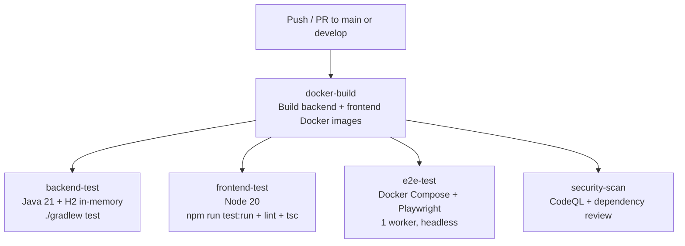

# Finance Tracker – Testing Guide

> **Version**: 1.0.0  
> **Last Updated**: March 17, 2026  
> **Total Tests**: 168 (103 backend + 18 frontend + 47 E2E)

---

## Table of Contents

- [Finance Tracker – Testing Guide](#finance-tracker--testing-guide)
  - [Table of Contents](#table-of-contents)
  - [1. Overview of Testing Strategy](#1-overview-of-testing-strategy)
  - [2. Backend Testing (JUnit 5 + MockMvc)](#2-backend-testing-junit-5--mockmvc)
    - [Pattern Example](#pattern-example)
    - [Notable Files](#notable-files)
    - [Commands](#commands)
  - [3. Frontend Testing (Vitest + React Testing Library)](#3-frontend-testing-vitest--react-testing-library)
    - [Patterns \& Setup](#patterns--setup)
    - [Commands](#commands-1)
  - [4. End-to-End Testing (Playwright)](#4-end-to-end-testing-playwright)
    - [Key Files](#key-files)
    - [Patterns \& Setup](#patterns--setup-1)
    - [Auth Test Notes](#auth-test-notes)
    - [Commands](#commands-2)
    - [GitHub Actions CI](#github-actions-ci)
    - [Current Status](#current-status)
  - [5. CI Integration](#5-ci-integration)
  - [6. Test Coverage Summary](#6-test-coverage-summary)
  - [7. Test Fixtures and Helpers](#7-test-fixtures-and-helpers)
  - [8. Quick Reference](#8-quick-reference)
  - [9. Environment Notes](#9-environment-notes)

---

## 1. Overview of Testing Strategy

- **Multi-layer coverage**: Unit + integration tests on backend; unit/component tests on frontend; end-to-end user flows with Playwright.
- **Fast feedback**: Frontend unit tests and selective backend test suites for quick iteration; E2E suites for release validation.
- **Deterministic environments**: Backend integration tests use H2 in-memory DB; E2E uses Playwright with seeded UI state via helpers.
- **CI integration**: GitHub Actions runs lint, unit, and E2E tests headless with artifacts (reports, screenshots) on failure.
- **Isolation and data integrity**: Tests isolate user data and always route via `/api/v1` with proper auth and CSRF.

---

## 2. Backend Testing (JUnit 5 + MockMvc)

- **Location**: `backend/src/test/java/...`
- **Tech stack**: Spring Boot 3.2, JUnit 5, MockMvc, H2 for integration tests.
- **Key base class**: `BaseIntegrationTest` for authenticated and environment setup.

### Pattern Example

```java
public class MyControllerIntegrationTest extends BaseIntegrationTest {
    @Test
    void testEndpoint() throws Exception {
        Cookie authCookie = registerAndLogin("user", "user@test.com", "SecureP@ssw0rd!");
        mockMvc.perform(get("/api/v1/endpoint").cookie(authCookie))
              .andExpect(status().isOk());
    }
}
```

### Notable Files

- `backend/src/test/java/.../BaseIntegrationTest.java`
- `backend/src/test/java/.../ApiTestSuite.java`
- Controller integration tests: `*ControllerIntegrationTest.java` across feature packages.

### Backend Test Commands

Run all tests:

```zsh
source ~/.bash_profile
cd backend
./gradlew test
```

Run API test suite:

```zsh
cd backend
./gradlew test --tests "com.financetracker.ApiTestSuite"
```

Run controller tests only:

```zsh
cd backend
./gradlew test --tests "*ControllerIntegrationTest"
```

**Troubleshooting**:

- Ensure Java 21 is active: `source ~/.bash_profile` (project requirement).
- Logs: `backend/logs/` and `backend/build/reports/tests/test/index.html`.

---

## 3. Frontend Testing (Vitest + React Testing Library)

- **Test count**: 18 Vitest unit tests.
- **Location**: `frontend/src/test/` and `frontend/src/components/__tests__/`
- **Tech**: Vitest, React Testing Library

### Frontend Testing Patterns

- **API services**: Tests import `apiClient` and `ENDPOINTS` from `frontend/src/lib/api-client.ts` and `frontend/src/config/api.ts` respectively; mock HTTP with built-in Vitest mocks or custom helpers.
- **Components**: Use RTL queries (`getByRole`, `findByText`, etc.) and avoid implementation details.

### Frontend Test Commands

Run unit tests:

```zsh
cd frontend
npm test
```

Run with coverage:

```zsh
cd frontend
npm run test:coverage
```

---

## 4. End-to-End Testing (Playwright)

- **Test count**: 47 tests across 7 spec files:
  - `frontend/e2e/smoke.spec.ts`
  - `frontend/e2e/auth.spec.ts`
  - `frontend/e2e/transactions.spec.ts`
  - `frontend/e2e/accounts.spec.ts`
  - `frontend/e2e/recurring-transactions.spec.ts`
  - `frontend/e2e/additional-features.spec.ts`
  - `frontend/e2e/demo.spec.ts`
- **Config**: `frontend/playwright.config.ts`
  - Local workers: 4
  - Parallel execution enabled
  - Reporters for CI (HTML) and retry settings configured.
- **Artifacts**: `frontend/playwright-report/` and `frontend/test-results/` (screenshots, videos)
- **Runner**: Playwright
- **Base URL**: `http://localhost:5173`
- **Dev server**: `npm run dev` started automatically by Playwright
- **Parallel execution enabled** (`fullyParallel: true`)
- **Workers**: `4` local, `1` in CI
- **Reporters**: html

### Key Files

- `frontend/playwright.config.ts` → global config with webServer
- `frontend/e2e/*.spec.ts` → test suites
- `frontend/e2e/fixtures/auth.ts` → helpers: register via API, login via UI, setupAuthenticatedPage

### E2E Testing Patterns

- **Fixtures**: Reusable login and navigation flows under `frontend/e2e/fixtures/`.
- **Selectors**: Prefer accessible roles and labels; avoid brittle CSS selectors.
- **State**: Tests run independently; data is either created via UI steps or reset using helper routes.

### Auth Test Notes

- **E2E test credentials**: Dynamically generated usernames (`e2euser<sessionId>`) with password `Admin@12345678` (see `frontend/e2e/fixtures/auth.ts`)
- **Demo mode credentials**: `demo@example.com` / `Demo123!` (seeded via `V100__seed_demo_user_and_accounts.sql`)
- **Registration in tests** uses Backend API (`POST /api/v1/auth/register`) due to frontend redirect behavior
- **Login page selectors** use `input#username` and `input#password`
- After login, expect navigation to protected routes (e.g., dashboard)
- **Password policy** special characters allowed: `@$!%*?&`

### E2E Test Commands

Run E2E tests:

```zsh
cd frontend
npm run test:e2e
```

Run in headed mode:

```zsh
cd frontend
npx playwright test --headed
```

Run with UI mode:

```zsh
cd frontend
npm run test:e2e:ui
```

Debug a single spec:

```zsh
cd frontend
npm run test:e2e:debug -- e2e/transactions.spec.ts
```

View HTML report:

```zsh
cd frontend
npx playwright show-report
```

### GitHub Actions CI

- Workflow executes Playwright in headless mode with 1 worker in CI.
- Uploads Playwright report and failure artifacts.
- Runs on pushes and PRs targeting `main` and `develop`.

### Current Status

- Smoke and auth E2E tests pass.
- Several feature suites (accounts, notifications) are failing due to incomplete UI elements.
- Prefer API-based setup in fixtures for stability and speed.

---

## 5. CI Integration

- **Workflow**: `.github/workflows/ci.yml`
- **Workers** reduced to 1 for stability in CI
- **Uploads** HTML report and artifacts for failures

### CI Pipeline Overview



---

## 6. Test Coverage Summary

| Type | Count | Status |
|------|-------|--------|
| Backend Unit/Integration | 103 | ✅ Passing |
| Frontend Unit | 18 | ✅ Passing |
| E2E (Playwright) | 47 | ⚠️ Partial (smoke/auth pass) |
| **Total** | **168** | ✅ Core coverage complete |

Reports:

- Coverage: typically in `frontend/coverage/`.
- JUnit-style and HTML reports configurable via Vitest options.

---

## 7. Test Fixtures and Helpers

- **Backend**:
  - `BaseIntegrationTest` provides auth cookie and common setup.
  - Utility classes under `backend/src/test/java/.../util/` if present.
- **Frontend**:
  - Shared mocks and render helpers under `frontend/src/test/`.
  - `apiClient` and `ENDPOINTS` are centralized in `frontend/src/lib/api-client.ts` and `frontend/src/config/api.ts` for consistent API interactions.
- **Playwright**:
  - Reusable flows under `frontend/e2e/fixtures/`.
  - Test artifacts stored in `frontend/test-results/` and consolidated report in `frontend/playwright-report/`.

---

## 8. Quick Reference

- Backend
  - `./gradlew test`
  - `./gradlew test --tests "com.financetracker.ApiTestSuite"`
- Frontend
  - `npm test`
  - `npm run test:coverage`
- E2E
  - `npm run test:e2e`
  - `npm run test:e2e:ui`
  - `npm run test:e2e:debug -- e2e/<file>.spec.ts`

---

## 9. Environment Notes

- Source Java environment before backend commands:

  ```zsh
  source ~/.bash_profile
  ```

- Local dev servers:
  - Backend dev: `cd backend && ./gradlew bootRun`
  - Frontend dev: `cd frontend && npm run dev`
- Docker-based full stack:

  ```zsh
  docker compose up -d
  docker logs finance-tracker-backend
  ```

---

For more details, see `docs/development/DEVELOPMENT_GUIDE.md`, `docs/api/API_REFERENCE.md`, and `docs/architecture/ARCHITECTURE.md`. Refer to file paths like `frontend/e2e/*.spec.ts` and `backend/src/test/java` when exploring or updating tests.
